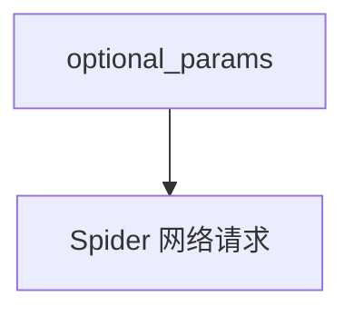

# spider_tools.py — 实现原理分析

<!-- cookbook-py-source:start -->
## 完整源码

```python
"""
Spider Tools
=============================

Demonstrates spider tools.
"""

from agno.agent import Agent
from agno.tools.spider import SpiderTools

# ---------------------------------------------------------------------------
# Create Agent
# ---------------------------------------------------------------------------


# Example 1: All functions available (default behavior)
agent_all = Agent(
    name="Spider Agent - All Functions",
    tools=[SpiderTools(optional_params={"proxy_enabled": True})],
    instructions=["You have access to all Spider web scraping capabilities."],
    markdown=True,
)

# Example 2: Include specific functions only
agent_specific = Agent(
    name="Spider Agent - Search Only",
    tools=[SpiderTools(enable_crawl=False, optional_params={"proxy_enabled": True})],
    instructions=["You can only search the web, no scraping or crawling."],
    markdown=True,
)


# Use the default agent for examples
agent = agent_all

# ---------------------------------------------------------------------------
# Run Agent
# ---------------------------------------------------------------------------
if __name__ == "__main__":
    agent.print_response(
        'Can you scrape the first search result from a search on "news in USA"?'
    )
```

<!-- cookbook-py-source:end -->

> 源文件：`cookbook/91_tools/spider_tools.py`

## 概述

本示例展示 **`SpiderTools`** 与 **`optional_params`**（如 `proxy_enabled`），以及限制为搜索-only 的 `enable_crawl=False` 配置。

**核心配置一览（`agent_all`）**

| 配置项 | 值 | 说明 |
|--------|------|------|
| `name` | `"Spider Agent - All Functions"` |  |
| `tools` | `[SpiderTools(optional_params={"proxy_enabled": True})]` |  |
| `instructions` | `["You have access to all Spider web scraping capabilities."]` |  |
| `markdown` | `True` |  |

## System Prompt 组装

```text
- You have access to all Spider web scraping capabilities.

<additional_information>
- Use markdown to format your answers.
</additional_information>
```

## Mermaid 流程图



## 关键源码文件索引

| 文件 | 作用 |
|------|------|
| `agno/tools/spider/` | `SpiderTools` |
