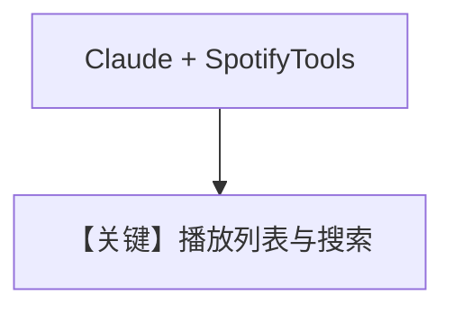

# spotify_tools.py — 实现原理分析

<!-- cookbook-py-source:start -->
## 完整源码

```python
"""
Example: Using SpotifyTools with an Agno Agent

This example shows how to create an agent that can:
- Search for songs by mood, artist, or genre
- Create playlists based on user requests
- Update existing playlists
"""

from os import getenv

from agno.agent import Agent
from agno.models.anthropic import Claude
from agno.tools.spotify import SpotifyTools

# ---------------------------------------------------------------------------
# Create Agent
# ---------------------------------------------------------------------------


# Your Spotify access token (get one from https://developer.spotify.com)
SPOTIFY_TOKEN = getenv("SPOTIFY_TOKEN")

# Initialize the Spotify toolkit
spotify = SpotifyTools(
    access_token=SPOTIFY_TOKEN,
    default_market="US",
)

# Create an agent with the Spotify toolkit
agent = Agent(
    name="Spotify DJ",
    model=Claude(id="claude-sonnet-4-20250514"),
    tools=[spotify],
    instructions=[
        "You are a helpful music assistant that can search for songs and manage Spotify playlists.",
        "When asked to create a playlist:",
        "1. First search for relevant tracks based on the user's criteria (mood, artist, genre)",
        "2. Collect the track URIs from the search results",
        "3. Create the playlist with those tracks",
        "When updating a playlist, use the playlist ID from a previous creation or ask the user for it.",
        "Always confirm what you've done and provide the playlist URL when created.",
    ],
    markdown=True,
)

# Example usage
# ---------------------------------------------------------------------------
# Run Agent
# ---------------------------------------------------------------------------

if __name__ == "__main__":
    # Example 1: Create a playlist with happy songs from specific artists
    response = agent.run(
        "Create a Good Vibes playlist, add 5 upbeat songs by The Weeknd and Coldplay in it."
    )
    print(response.content)
    print("\n" + "=" * 50 + "\n")

    # Example 2: Update the playlist
    # Note: You'd need the playlist_id from the previous response
    # response = agent.run(
    #     "Add 5 more upbeat songs by the Beatles to the Good Vibes playlist"
    # )
    # print(response.content)
```

<!-- cookbook-py-source:end -->

> 源文件：`cookbook/91_tools/spotify_tools.py`

## 概述

本示例展示 **`Claude`** 模型与 **`SpotifyTools`**（`access_token`、`default_market`），并用 **`agent.run()`** 而非 `print_response` 获取回复。

**核心配置一览**

| 配置项 | 值 | 说明 |
|--------|------|------|
| `name` | `"Spotify DJ"` |  |
| `model` | `Claude(id="claude-sonnet-4-20250514")` | Anthropic Messages API |
| `tools` | `[spotify]` | `SpotifyTools(access_token=SPOTIFY_TOKEN, default_market="US")` |
| `instructions` | 多行：搜索曲目、建歌单、更新、确认 URL |  |
| `markdown` | `True` |  |

## 完整 API 请求

Anthropic 适配器：`messages.create` 类调用（见 `agno/models/anthropic/claude.py` 中 `invoke`），system 与 tools 随适配器转换。

## Mermaid 流程图



## 关键源码文件索引

| 文件 | 作用 |
|------|------|
| `agno/models/anthropic/claude.py` | Claude 调用 |
| `agno/tools/spotify/` | `SpotifyTools` |
