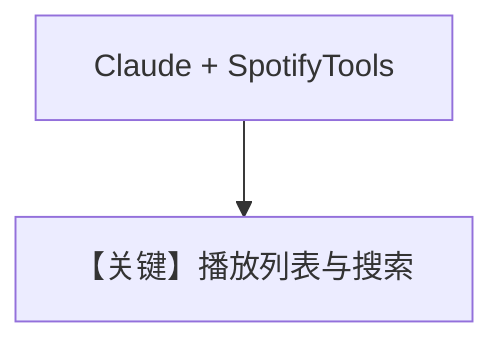

# spotify_tools.py — 实现原理分析

> 源文件：`cookbook/91_tools/spotify_tools.py`

## 概述

本示例展示 **`Claude`** 模型与 **`SpotifyTools`**（`access_token`、`default_market`），并用 **`agent.run()`** 而非 `print_response` 获取回复。

**核心配置一览**

| 配置项 | 值 | 说明 |
|--------|------|------|
| `name` | `"Spotify DJ"` |  |
| `model` | `Claude(id="claude-sonnet-4-20250514")` | Anthropic Messages API |
| `tools` | `[spotify]` | `SpotifyTools(access_token=SPOTIFY_TOKEN, default_market="US")` |
| `instructions` | 多行：搜索曲目、建歌单、更新、确认 URL |  |
| `markdown` | `True` |  |

## 完整 API 请求

Anthropic 适配器：`messages.create` 类调用（见 `agno/models/anthropic/claude.py` 中 `invoke`），system 与 tools 随适配器转换。

## Mermaid 流程图

## 关键源码文件索引

| 文件 | 作用 |
|------|------|
| `agno/models/anthropic/claude.py` | Claude 调用 |
| `agno/tools/spotify/` | `SpotifyTools` |
