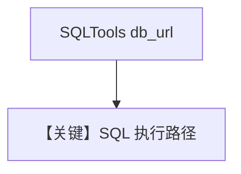

# sql_tools.py — 实现原理分析

> 源文件：`cookbook/91_tools/sql_tools.py`

## 概述

本示例展示 **`SQLTools(db_url=...)`** 连接 **PostgreSQL**（连接串指向 `localhost:5532` 示例库）。

**核心配置一览**

| 配置项 | 值 | 说明 |
|--------|------|------|
| `tools` | `[SQLTools(db_url=db_url)]` |  |
| `model` | 默认 |  |

## 运行机制与因果链

**副作用**：对数据库执行查询/元数据类操作（取决于工具实现）。

## Mermaid 流程图

## 关键源码文件索引

| 文件 | 作用 |
|------|------|
| `agno/tools/sql/` | `SQLTools` |
