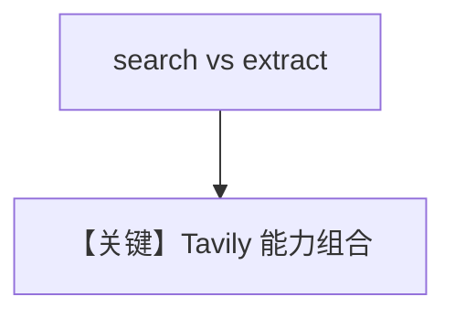

# tavily_tools.py — 实现原理分析

> 源文件：`cookbook/91_tools/tavily_tools.py`

## 概述

本示例集中展示 **`TavilyTools`** 的多种组合：**search/extract**、`api_base_url`、**`extract_depth`/`extract_format`**、**`combined_agent`** 等，主入口依次跑搜索与提取示例。

**核心配置一览（`agent`）**

| 配置项 | 值 | 说明 |
|--------|------|------|
| `tools` | `[TavilyTools()]` | 默认 |
| `model` | 默认 |  |

## 运行机制与因果链

需 Tavily API Key；多个 Agent 实例并行定义，**仅**在 `__main__` 中分别 `print_response`。

## Mermaid 流程图

## 关键源码文件索引

| 文件 | 作用 |
|------|------|
| `agno/tools/tavily/` | `TavilyTools` |
