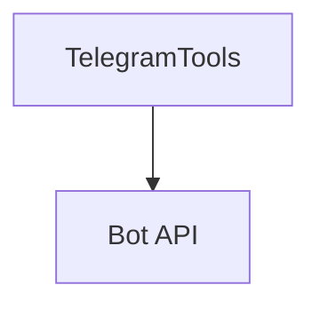

# telegram_tools.py — 实现原理分析

<!-- cookbook-py-source:start -->
## 完整源码

```python
"""
Telegram Tools - Bot Communication and Messaging

This example demonstrates how to use TelegramTools for Telegram bot operations.
Shows enable_ flag patterns for selective function access.
TelegramTools is a small tool (<6 functions) so it uses enable_ flags.

Prerequisites:
- Create a new bot with BotFather on Telegram: https://core.telegram.org/bots/features#creating-a-new-bot
- Get the token from BotFather
- Send a message to the bot
- Get the chat_id by going to: https://api.telegram.org/bot<your-bot-token>/getUpdates
"""

from agno.agent import Agent
from agno.tools.telegram import TelegramTools

# ---------------------------------------------------------------------------
# Create Agent
# ---------------------------------------------------------------------------


telegram_token = "<enter-your-bot-token>"
chat_id = "<enter-your-chat-id>"

# Example 1: All functions enabled (default behavior)
agent = Agent(
    name="telegram-full",
    tools=[
        TelegramTools(token=telegram_token, chat_id=chat_id)
    ],  # All functions enabled
    description="You are a comprehensive Telegram bot assistant with all messaging capabilities.",
    instructions=[
        "Help users with all Telegram bot operations",
        "Send messages, handle media, and manage bot interactions",
        "Provide clear feedback on bot operations",
        "Follow Telegram bot best practices",
    ],
    markdown=True,
)

# ---------------------------------------------------------------------------
# Run Agent
# ---------------------------------------------------------------------------
if __name__ == "__main__":
    agent.print_response("Send a message to the bot")
```

<!-- cookbook-py-source:end -->

> 源文件：`cookbook/91_tools/telegram_tools.py`

## 概述

本示例展示 **`TelegramTools(token=..., chat_id=...)`** 与 **`description` + instructions**（Bot 操作与最佳实践）。

**核心配置一览**

| 配置项 | 值 | 说明 |
|--------|------|------|
| `name` | `"telegram-full"` |  |
| `tools` | `[TelegramTools(token=..., chat_id=...)]` | 占位符需替换 |
| `description` | `"You are a comprehensive Telegram bot assistant..."` |  |
| `instructions` | 4 条 |  |
| `markdown` | `True` |  |

## System Prompt 组装

字面量含 `description` 与多行 `instructions`（见源码），并含 markdown 段。

## Mermaid 流程图



## 关键源码文件索引

| 文件 | 作用 |
|------|------|
| `agno/tools/telegram/` | `TelegramTools` |
