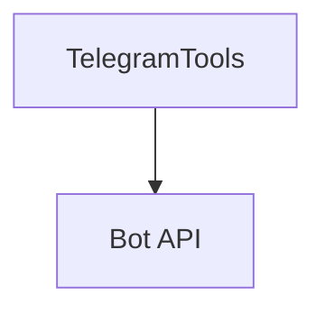

# telegram_tools.py — 实现原理分析

> 源文件：`cookbook/91_tools/telegram_tools.py`

## 概述

本示例展示 **`TelegramTools(token=..., chat_id=...)`** 与 **`description` + instructions**（Bot 操作与最佳实践）。

**核心配置一览**

| 配置项 | 值 | 说明 |
|--------|------|------|
| `name` | `"telegram-full"` |  |
| `tools` | `[TelegramTools(token=..., chat_id=...)]` | 占位符需替换 |
| `description` | `"You are a comprehensive Telegram bot assistant..."` |  |
| `instructions` | 4 条 |  |
| `markdown` | `True` |  |

## System Prompt 组装

字面量含 `description` 与多行 `instructions`（见源码），并含 markdown 段。

## Mermaid 流程图

## 关键源码文件索引

| 文件 | 作用 |
|------|------|
| `agno/tools/telegram/` | `TelegramTools` |
