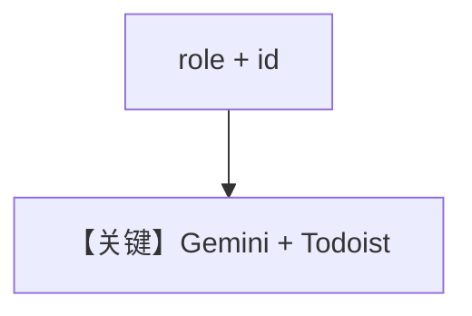

# todoist_tools.py — 实现原理分析

<!-- cookbook-py-source:start -->
## 完整源码

```python
"""
Example showing how to use the Todoist Tools with Agno

Requirements:
- Sign up/login to Todoist and get a Todoist API Token (get from https://app.todoist.com/app/settings/integrations/developer)
- uv pip install todoist-api-python

Usage:
- Set the following environment variables:
    export TODOIST_API_TOKEN="your_api_token"

- Or provide them when creating the TodoistTools instance
"""

from agno.agent import Agent
from agno.models.google.gemini import Gemini
from agno.tools.todoist import TodoistTools

# ---------------------------------------------------------------------------
# Create Agent
# ---------------------------------------------------------------------------


# Example 1: All functions available (default behavior)
todoist_agent_all = Agent(
    name="Todoist Agent - All Functions",
    role="Manage your todoist tasks with full capabilities",
    instructions=[
        "You have access to all Todoist operations.",
        "You can create, read, update, delete tasks and manage projects.",
    ],
    id="todoist-agent-all",
    model=Gemini("gemini-3-flash-preview"),
    tools=[TodoistTools()],
    markdown=True,
)


# Example 3: Exclude dangerous functions
todoist_agent = Agent(
    name="Todoist Agent - Safe Mode",
    role="Manage your todoist tasks safely",
    instructions=[
        "You can create and update tasks but cannot delete anything.",
        "You have read access to all tasks and projects.",
    ],
    id="todoist-agent-safe",
    model=Gemini("gemini-3-flash-preview"),
    tools=[TodoistTools(exclude_tools=["delete_task"])],
    markdown=True,
)


# Example 1: Create a task

# ---------------------------------------------------------------------------
# Run Agent
# ---------------------------------------------------------------------------
if __name__ == "__main__":
    print("\n=== Create a task ===")
    todoist_agent_all.print_response(
        "Create a todoist task to buy groceries tomorrow at 10am"
    )

    # Example 2: Delete a task
    print("\n=== Delete a task ===")
    todoist_agent.print_response(
        "Delete the todoist task to buy groceries tomorrow at 10am"
    )
```

<!-- cookbook-py-source:end -->

> 源文件：`cookbook/91_tools/todoist_tools.py`

## 概述

本示例展示 **`Gemini("gemini-3-flash-preview")`** 与 **`TodoistTools`** 的全功能与安全模式（`exclude_tools=["delete_task"]`），并演示 **`role`** 与 **`id`** 字段。

**核心配置一览（`todoist_agent_all`）**

| 配置项 | 值 | 说明 |
|--------|------|------|
| `name` | `"Todoist Agent - All Functions"` |  |
| `role` | `"Manage your todoist tasks with full capabilities"` | 映射到 `# 3.3.2` `<your_role>` |
| `id` | `"todoist-agent-all"` | 会话/实体标识 |
| `model` | `Gemini("gemini-3-flash-preview")` | Google 适配器 |
| `tools` | `[TodoistTools()]` |  |
| `instructions` | 2 条 |  |
| `markdown` | `True` |  |

## System Prompt 组装

含 `role` 时内容进入 `<your_role>...</your_role>`（`agno/agent/_messages.py` `# 3.3.2`）。

## 完整 API 请求

Google Gemini 适配器请求形态（见 `agno/models/google/gemini.py`）。

## Mermaid 流程图



## 关键源码文件索引

| 文件 | 作用 |
|------|------|
| `agno/agent/_messages.py` | `# 3.3.2` role |
| `agno/tools/todoist/` | `TodoistTools` |
