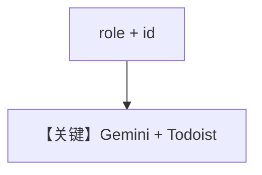

# todoist_tools.py — 实现原理分析

> 源文件：`cookbook/91_tools/todoist_tools.py`

## 概述

本示例展示 **`Gemini("gemini-3-flash-preview")`** 与 **`TodoistTools`** 的全功能与安全模式（`exclude_tools=["delete_task"]`），并演示 **`role`** 与 **`id`** 字段。

**核心配置一览（`todoist_agent_all`）**

| 配置项 | 值 | 说明 |
|--------|------|------|
| `name` | `"Todoist Agent - All Functions"` |  |
| `role` | `"Manage your todoist tasks with full capabilities"` | 映射到 `# 3.3.2` `<your_role>` |
| `id` | `"todoist-agent-all"` | 会话/实体标识 |
| `model` | `Gemini("gemini-3-flash-preview")` | Google 适配器 |
| `tools` | `[TodoistTools()]` |  |
| `instructions` | 2 条 |  |
| `markdown` | `True` |  |

## System Prompt 组装

含 `role` 时内容进入 `<your_role>...</your_role>`（`agno/agent/_messages.py` `# 3.3.2`）。

## 完整 API 请求

Google Gemini 适配器请求形态（见 `agno/models/google/gemini.py`）。

## Mermaid 流程图

## 关键源码文件索引

| 文件 | 作用 |
|------|------|
| `agno/agent/_messages.py` | `# 3.3.2` role |
| `agno/tools/todoist/` | `TodoistTools` |
