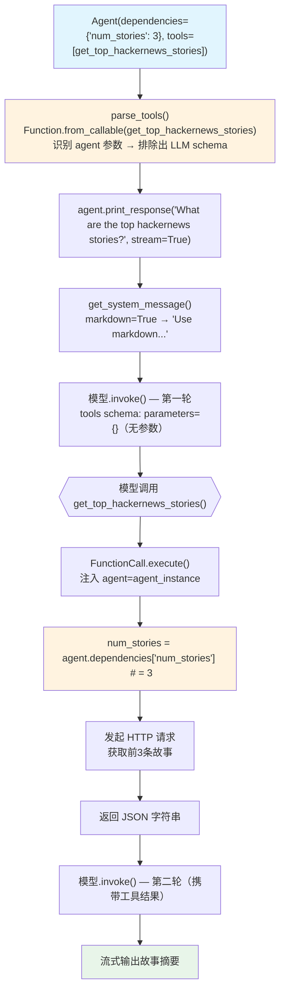

# tool_calls_accesing_agent.py — 实现原理分析

> 源文件：`cookbook/91_tools/tool_calls_accesing_agent.py`

## 概述

本示例展示在**普通函数（未使用 `@tool` 装饰器）中通过 `agent: Agent` 参数注入访问 `dependencies`** 的机制：将普通 Python 函数直接传入 `tools` 列表，框架自动将其包装为 `Function` 对象，并识别 `agent` 参数进行注入（不暴露给 LLM）。

**核心配置一览：**

| 配置项 | 值 | 说明 |
|--------|------|------|
| `model` | `None` | 未显式设置 |
| `dependencies` | `{"num_stories": 3}` | 工具通过 `agent.dependencies` 读取 |
| `tools` | `[get_top_hackernews_stories]` | 普通函数（无 @tool 装饰器） |
| `markdown` | `True` | Markdown 格式化 |
| 函数签名 `agent: Agent` | 框架自动注入 Agent 实例 | 从 LLM schema 排除 |

## 架构分层

```
用户代码层                      agno.agent 层
┌─────────────────────────┐    ┌────────────────────────────────────┐
│ tool_calls_accesing_    │    │ Agent._run()                       │
│ agent.py                │    │  ├─ get_tools() → parse_tools()    │
│                         │    │  │   Function.from_callable(       │
│ def get_top_hackernews_ │    │  │     get_top_hackernews_stories  │
│ stories(agent: Agent)   │───>│  │   )                             │
│   -> str:               │    │  │   识别 agent 参数 → 排除 schema │
│   num = agent.          │    │  │                                  │
│     dependencies["..."] │    │  └─ FunctionCall.execute()         │
│   ...                   │    │      → function.entrypoint(agent=.)│
│                         │    └────────────────────────────────────┘
│ Agent(                  │
│   dependencies={        │
│     "num_stories": 3    │
│   },                    │
│   tools=[get_top_hacker]│
│ )                       │
└─────────────────────────┘
```

## 核心组件解析

### 普通函数直接作为工具

```python
def get_top_hackernews_stories(agent: Agent) -> str:
    # 通过 agent.dependencies 获取配置
    num_stories = agent.dependencies.get("num_stories", 5) if agent.dependencies else 5
    
    response = httpx.get("https://hacker-news.firebaseio.com/v0/topstories.json")
    story_ids = response.json()
    
    stories = []
    for story_id in story_ids[:num_stories]:
        story_response = httpx.get(f".../item/{story_id}.json")
        story = story_response.json()
        if "text" in story:
            story.pop("text", None)
        stories.append(story)
    return json.dumps(stories)
```

框架在 `parse_tools()` 中调用 `Function.from_callable()` 将普通函数包装，效果与 `@tool` 装饰器相同。

### 与 @tool 装饰器的等价性

| 方式 | 等价效果 | 区别 |
|------|---------|------|
| 普通函数传入 tools | `Function.from_callable(func)` | 无法配置 `show_result`、`stop_after_tool_call` 等 |
| `@tool` 装饰器 | `Function.from_callable(func, **kwargs)` | 可配置所有 Function 属性 |

对于不需要特殊配置的工具，直接传入普通函数即可，框架会使用默认值创建 `Function`（`show_result=False`, `stop_after_tool_call=False` 等）。

### agent 参数注入的识别

`Function.from_callable()` 分析函数签名：

```python
# 识别特殊参数（不暴露给 LLM）：
# agent: Agent → 注入 agent 实例
# run_context: RunContext → 注入当前 RunContext
# team: Team → 注入 Team 实例（如有）
```

LLM 的 `parameters` schema 中只看到业务参数（如 `num_stories`），`agent` 参数完全隐藏。

## System Prompt 组装

| 序号 | 组成部分 | 本文件中的值/来源 | 是否生效 |
|------|---------|-----------------|---------|
| 1 | `system_message` | `None` | 否 |
| 3.1 | `instructions` | `None` | 否 |
| 3.2.1 | `markdown` | `True` → "Use markdown to format your answers." | 是 |

### 最终 System Prompt

```text
Use markdown to format your answers.
```

## 完整 API 请求

```python
client.chat.completions.create(
    model="<default-model>",
    messages=[
        {"role": "system", "content": "Use markdown to format your answers."},
        {"role": "user", "content": "What are the top hackernews stories?"}
    ],
    tools=[
        {
            "type": "function",
            "function": {
                "name": "get_top_hackernews_stories",
                "description": "...",  # 从函数 docstring 提取（如有）
                "parameters": {
                    "type": "object",
                    "properties": {},   # agent 参数被排除，无业务参数
                    "required": []
                }
            }
        }
    ],
    stream=True
)
```

## Mermaid 流程图



## 关键源码文件索引

| 文件 | 关键函数/类 | 作用 |
|------|------------|------|
| `agno/tools/function.py` | `Function.from_callable()` | 将普通函数包装为 Function |
| `agno/agent/_tools.py` | `parse_tools()` L350 | 识别并排除 agent 等特殊参数 |
| `agno/agent/agent.py` | `dependencies` L105 | 工具可访问的依赖字典 |
| `agno/agent/_messages.py` | `get_system_message()` L106 | 组装 system prompt |
