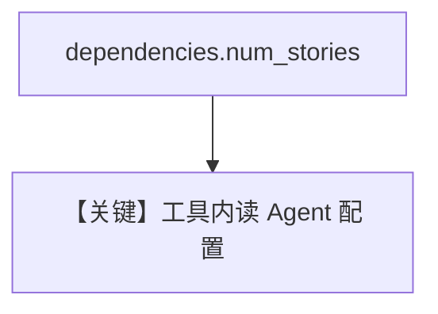

# tool_calls_accesing_agent.py — 实现原理分析

<!-- cookbook-py-source:start -->
## 完整源码

```python
"""
Tool Calls Accesing Agent
=============================

Demonstrates tool calls accesing agent.
"""

import json

import httpx
from agno.agent import Agent

# ---------------------------------------------------------------------------
# Create Agent
# ---------------------------------------------------------------------------


def get_top_hackernews_stories(agent: Agent) -> str:
    num_stories = agent.dependencies.get("num_stories", 5) if agent.dependencies else 5

    # Fetch top story IDs
    response = httpx.get("https://hacker-news.firebaseio.com/v0/topstories.json")
    story_ids = response.json()

    # Fetch story details
    stories = []
    for story_id in story_ids[:num_stories]:
        story_response = httpx.get(
            f"https://hacker-news.firebaseio.com/v0/item/{story_id}.json"
        )
        story = story_response.json()
        if "text" in story:
            story.pop("text", None)
        stories.append(story)
    return json.dumps(stories)


agent = Agent(
    dependencies={
        "num_stories": 3,
    },
    tools=[get_top_hackernews_stories],
    markdown=True,
)

# ---------------------------------------------------------------------------
# Run Agent
# ---------------------------------------------------------------------------
if __name__ == "__main__":
    agent.print_response("What are the top hackernews stories?", stream=True)
```

<!-- cookbook-py-source:end -->

> 源文件：`cookbook/91_tools/tool_calls_accesing_agent.py`

## 概述

本示例展示 **工具函数第一个参数为 `Agent`**，从 **`agent.dependencies`** 读取 `num_stories`（默认 5），与仅传函数、无 Agent 形参的示例形成对比。

**核心配置一览**

| 配置项 | 值 | 说明 |
|--------|------|------|
| `dependencies` | `{"num_stories": 3}` | 注入到 context/依赖 |
| `tools` | `[get_top_hackernews_stories]` | 签名含 `agent: Agent` |
| `markdown` | `True` |  |

## 运行机制与因果链

1. **路径**：框架调用工具时将当前 `Agent` 注入；函数内读取 `dependencies` 决定拉取条数。
2. **副作用**：HTTP 请求 HN API。

## System Prompt 组装

无字面量 `instructions`；含 markdown 段（`markdown=True`）。

## Mermaid 流程图


```mermaid
flowchart TD
    A["dependencies.num_stories"] --> B["【关键】工具内读 Agent 配置"]
```

## 关键源码文件索引

| 文件 | 作用 |
|------|------|
| `agno/tools/function.py` | Agent 注入约定 |
