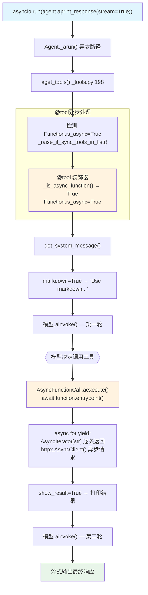

# async_tool_decorator.py — 实现原理分析

> 源文件：`cookbook/91_tools/tool_decorator/async_tool_decorator.py`

## 概述

本示例展示 Agno 的 **异步 `@tool` 装饰器**机制：使用 `async def` 函数配合 `AsyncIterator[str]` 实现异步流式工具，通过 `agent.aprint_response()` + `asyncio.run()` 在异步上下文中执行。框架自动识别协程函数并切换到异步执行路径。

**核心配置一览：**

| 配置项 | 值 | 说明 |
|--------|------|------|
| `model` | `None` | 未显式设置，使用环境默认 |
| `dependencies` | `{"num_stories": 2}` | 工具通过 `agent.dependencies` 读取 |
| `tools` | `[get_top_hackernews_stories]` | `@tool(show_result=True)` 装饰的异步生成器函数 |
| `markdown` | `True` | 输出 Markdown 格式 |
| `@tool show_result` | `True` | 工具返回值直接打印 |
| 异步模式 | `asyncio.run(agent.aprint_response(...))` | 全链路异步执行 |

## 架构分层

```
用户代码层                      agno.agent 层
┌─────────────────────────┐    ┌────────────────────────────────────┐
│ async_tool_decorator.py │    │ Agent._arun()  (异步路径)          │
│                         │    │  ├─ aget_tools()  _tools.py:198    │
│ @tool(show_result=True) │    │  │   _raise_if_sync_tools_in_list() │
│ async def get_stories(  │───>│  │   → 确保工具为异步               │
│   agent: Agent          │    │  │                                  │
│ ) -> AsyncIterator[str] │    │  ├─ get_system_message()            │
│                         │    │  │                                  │
│ asyncio.run(            │    │  └─ AsyncFunctionCall.aexecute()   │
│   agent.aprint_response │    │      → await function.entrypoint() │
│ )                       │    │      → async yield 逐条返回         │
└─────────────────────────┘    └────────────────────────────────────┘
                                              │
                                              ▼
                                    ┌──────────────────┐
                                    │ 默认模型（异步）   │
                                    │ ainvoke()        │
                                    └──────────────────┘
```

## 核心组件解析

### 异步工具检测

`@tool` 装饰器在 `decorator.py:_is_async_function()` 中通过以下方式检测异步函数：

```python
# decorator.py:12
def _is_async_function(func: Callable) -> bool:
    if iscoroutinefunction(func) or iscoroutine(func):
        return True
    # 检查 __wrapped__ 属性（如被 @staticmethod 包裹）
    if hasattr(func, "__wrapped__"):
        ...
    # 检查代码对象的 CO_COROUTINE 标志
    if hasattr(func, "__code__") and func.__code__.co_flags & 0x80:
        return True
```

检测后将 `Function.is_async = True`，确保在 `aget_tools()` 路径中正确处理。

### AsyncIterator[str] 工具

```python
@tool(show_result=True)
async def get_top_hackernews_stories(agent: Agent) -> AsyncIterator[str]:
    num_stories = agent.dependencies.get("num_stories", 5) if agent.dependencies else 5
    
    async with httpx.AsyncClient() as client:
        response = await client.get("https://hacker-news.firebaseio.com/v0/topstories.json")
        story_ids = response.json()
        
        for story_id in story_ids[:num_stories]:
            story_response = await client.get(f".../item/{story_id}.json")
            yield json.dumps(story)   # 每条故事单独 yield
```

`AsyncFunctionCall.aexecute()` 通过 `async for` 消费异步生成器，将所有 yield 的字符串合并为最终工具结果。

### 全链路异步执行

```python
# 用户入口
asyncio.run(agent.aprint_response("What are the top hackernews stories?", stream=True))

# Agent 内部：
# Agent.aprint_response() → Agent._arun() → aget_tools() → AsyncFunctionCall.aexecute()
```

同步 `Agent.print_response()` 内部使用 `aget_tools()` 时会检查工具是否为异步，如发现同步上下文调用异步工具会抛出错误。

## System Prompt 组装

| 序号 | 组成部分 | 本文件中的值/来源 | 是否生效 |
|------|---------|-----------------|---------|
| 1 | `system_message` | `None` | 否 |
| 3.1 | `instructions` | `None` | 否 |
| 3.1.1 | 模型指令 | 模型特定指令 | 是 |
| 3.2.1 | `markdown` | `True` → "Use markdown to format your answers." | 是 |
| 3.2.2 | `add_datetime_to_context` | `False` | 否 |
| 3.3.5 | `_tool_instructions` | `None` | 否 |

### 最终 System Prompt

```text
Use markdown to format your answers.
```

## 完整 API 请求

```python
# 异步工具与同步工具的 API 请求格式相同，异步仅影响 agno 内部执行路径
client.chat.completions.create(
    model="<default-model>",
    messages=[
        {"role": "system", "content": "Use markdown to format your answers."},
        {"role": "user", "content": "What are the top hackernews stories?"}
    ],
    tools=[
        {
            "type": "function",
            "function": {
                "name": "get_top_hackernews_stories",
                "description": "...",
                "parameters": {"type": "object", "properties": {}, "required": []}
                # agent 参数被排除
            }
        }
    ],
    stream=True,
    stream_options={"include_usage": True}
)
```

## Mermaid 流程图



## 关键源码文件索引

| 文件 | 关键函数/类 | 作用 |
|------|------------|------|
| `agno/tools/decorator.py` | `_is_async_function()` L12 | 检测是否为异步函数 |
| `agno/tools/decorator.py` | `tool()` L87 | 装饰器入口 |
| `agno/tools/function.py` | `Function.is_async` | 标记异步函数 |
| `agno/agent/_tools.py` | `aget_tools()` L198 | 异步工具收集路径 |
| `agno/agent/_messages.py` | `get_system_message()` L106 | 组装 system prompt |
