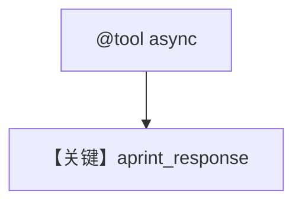

# async_tool_decorator.py — 实现原理分析

> 源文件：`cookbook/91_tools/tool_decorator/async_tool_decorator.py`

## 概述

本示例展示 **`@tool` 装饰异步生成器**：`AsyncIterator[str]` 逐条 yield HN story JSON；入口使用 **`asyncio.run(agent.aprint_response(...))`**。

**核心配置一览**

| 配置项 | 值 | 说明 |
|--------|------|------|
| `dependencies` | `{"num_stories": 2}` |  |
| `tools` | `[get_top_hackernews_stories]` | `@tool(show_result=True)` async |
| `markdown` | `True` |  |

## 运行机制与因果链

异步工具路径与 `aprint_response` 对齐；流式展示由 `show_result` 等标志影响。

## Mermaid 流程图

```mermaid
flowchart TD
    A["@tool async"] --> B["【关键】aprint_response"]
```

## 关键源码文件索引

| 文件 | 作用 |
|------|------|
| `agno/tools/decorator.py` 或 `agno/tools/__init__.py` | `@tool` |
