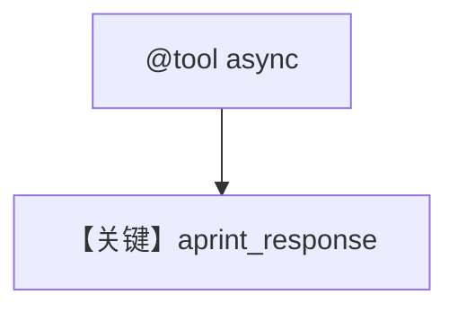

# async_tool_decorator.py — 实现原理分析

<!-- cookbook-py-source:start -->
## 完整源码

```python
"""
Async Tool Decorator
=============================

Demonstrates async tool decorator.
"""

import asyncio
import json
from typing import AsyncIterator

import httpx
from agno.agent import Agent
from agno.tools import tool

# ---------------------------------------------------------------------------
# Create Agent
# ---------------------------------------------------------------------------


@tool(show_result=True)
async def get_top_hackernews_stories(agent: Agent) -> AsyncIterator[str]:
    num_stories = agent.dependencies.get("num_stories", 5) if agent.dependencies else 5

    async with httpx.AsyncClient() as client:
        # Fetch top story IDs
        response = await client.get(
            "https://hacker-news.firebaseio.com/v0/topstories.json"
        )
        story_ids = response.json()

        # Yield story details
        for story_id in story_ids[:num_stories]:
            story_response = await client.get(
                f"https://hacker-news.firebaseio.com/v0/item/{story_id}.json"
            )
            story = story_response.json()
            if "text" in story:
                story.pop("text", None)
            yield json.dumps(story)


agent = Agent(
    dependencies={
        "num_stories": 2,
    },
    tools=[get_top_hackernews_stories],
    markdown=True,
)
# ---------------------------------------------------------------------------
# Run Agent
# ---------------------------------------------------------------------------

if __name__ == "__main__":
    asyncio.run(
        agent.aprint_response("What are the top hackernews stories?", stream=True)
    )
```

<!-- cookbook-py-source:end -->

> 源文件：`cookbook/91_tools/tool_decorator/async_tool_decorator.py`

## 概述

本示例展示 **`@tool` 装饰异步生成器**：`AsyncIterator[str]` 逐条 yield HN story JSON；入口使用 **`asyncio.run(agent.aprint_response(...))`**。

**核心配置一览**

| 配置项 | 值 | 说明 |
|--------|------|------|
| `dependencies` | `{"num_stories": 2}` |  |
| `tools` | `[get_top_hackernews_stories]` | `@tool(show_result=True)` async |
| `markdown` | `True` |  |

## 运行机制与因果链

异步工具路径与 `aprint_response` 对齐；流式展示由 `show_result` 等标志影响。

## Mermaid 流程图


```mermaid
flowchart TD
    A["@tool async"] --> B["【关键】aprint_response"]
```

## 关键源码文件索引

| 文件 | 作用 |
|------|------|
| `agno/tools/decorator.py` 或 `agno/tools/__init__.py` | `@tool` |
