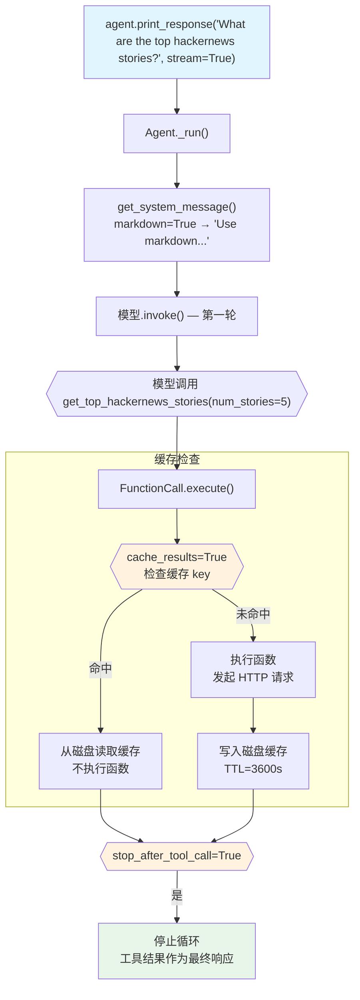

# cache_tool_calls.py — 实现原理分析

> 源文件：`cookbook/91_tools/tool_decorator/cache_tool_calls.py`

## 概述

本示例展示 `@tool` 装饰器的 **`cache_results`** 机制：对相同参数的工具调用结果进行磁盘缓存（默认 TTL 3600 秒），避免重复发起网络请求。同时组合 `stop_after_tool_call=True` 在工具执行后立即停止循环。

**核心配置一览：**

| 配置项 | 值 | 说明 |
|--------|------|------|
| `model` | `None` | 未显式设置 |
| `tools` | `[get_top_hackernews_stories]` | `@tool(stop_after_tool_call=True, cache_results=True)` |
| `markdown` | `True` | 输出 Markdown 格式 |
| `@tool stop_after_tool_call` | `True` | 工具执行后停止循环 |
| `@tool cache_results` | `True` | 启用磁盘缓存 |
| `@tool cache_ttl` | `3600`（默认） | 缓存有效期（秒） |
| `@tool cache_dir` | `None`（默认） | 使用系统临时目录 |

## 架构分层

```
用户代码层                      agno.agent 层
┌─────────────────────────┐    ┌────────────────────────────────────┐
│ cache_tool_calls.py     │    │ Agent._run()                       │
│                         │    │  ├─ FunctionCall.execute()         │
│ @tool(                  │    │  │   ├─ 检查缓存 key               │
│   stop_after_tool_call= │───>│  │   │   (函数名 + 参数哈希)        │
│   True,                 │    │  │   ├─ 命中: 从磁盘读取返回       │
│   cache_results=True    │    │  │   └─ 未命中: 执行函数 + 写缓存  │
│ )                       │    │  └─ stop_after_tool_call → 停止   │
│ def get_stories(num):   │    └────────────────────────────────────┘
│   return stories_str    │
└─────────────────────────┘
            │ 磁盘缓存（系统临时目录）
            ▼
    ┌───────────────────┐
    │ .cache/<hash>.pkl │
    └───────────────────┘
```

## 核心组件解析

### cache_results 机制

`Function.cache_results = True` 在 `FunctionCall.execute()` 中被检查：

```python
# function.py（简化）
def execute(self) -> FunctionExecutionResult:
    if self.function.cache_results:
        # 构建缓存 key：函数名 + 参数的哈希
        cache_key = f"{self.function.name}_{hash(frozenset(self.arguments.items()))}"
        cached = self._load_from_cache(cache_key)
        if cached is not None:
            return FunctionExecutionResult(result=cached, cached=True)
    
    result = self.function.entrypoint(**args)
    
    if self.function.cache_results:
        self._save_to_cache(cache_key, result, ttl=self.function.cache_ttl)
    
    return FunctionExecutionResult(result=result)
```

缓存文件存储在 `cache_dir`（默认为系统临时目录）中，以 pickle 格式序列化，TTL 通过文件元数据或文件内时间戳控制。

### 与 YFinanceTools(cache_results=True) 的区别

| 方式 | 作用域 | 配置位置 |
|------|--------|---------|
| `@tool(cache_results=True)` | 自定义函数级别 | `@tool` 装饰器参数 |
| `YFinanceTools(cache_results=True)` | Toolkit 级别所有工具 | Toolkit 构造函数参数 |

两种方式都将 `Function.cache_results = True`，底层共用相同的缓存逻辑。

### 组合 stop_after_tool_call

```python
@tool(stop_after_tool_call=True, cache_results=True)
def get_top_hackernews_stories(num_stories: int = 5) -> str:
    # 第一次调用：实际请求 + 写缓存
    # 相同参数的后续调用：从缓存读取，不发起网络请求
    response = httpx.get("https://hacker-news.firebaseio.com/v0/topstories.json")
    ...
    return "\n".join(stories)
```

`stop_after_tool_call=True` 和 `cache_results=True` 是相互独立的 Function 属性，可自由组合。

## System Prompt 组装

| 序号 | 组成部分 | 本文件中的值/来源 | 是否生效 |
|------|---------|-----------------|---------|
| 1 | `system_message` | `None` | 否 |
| 3.1 | `instructions` | `None` | 否 |
| 3.2.1 | `markdown` | `True` → "Use markdown to format your answers." | 是 |
| 3.3.5 | `_tool_instructions` | `None` | 否 |

### 最终 System Prompt

```text
Use markdown to format your answers.
```

## 完整 API 请求

```python
client.chat.completions.create(
    model="<default-model>",
    messages=[
        {"role": "system", "content": "Use markdown to format your answers."},
        {"role": "user", "content": "What are the top hackernews stories?"}
    ],
    tools=[
        {
            "type": "function",
            "function": {
                "name": "get_top_hackernews_stories",
                "description": "...",
                "parameters": {
                    "type": "object",
                    "properties": {
                        "num_stories": {"type": "integer", "default": 5}
                    },
                    "required": []
                }
            }
        }
    ],
    stream=True
)
# 工具执行后：cache_results → 写缓存；stop_after_tool_call → 停止，直接返回工具结果
```

## Mermaid 流程图



## 关键源码文件索引

| 文件 | 关键函数/类 | 作用 |
|------|------------|------|
| `agno/tools/decorator.py` | `tool()` L87 | 解析 cache_results/cache_ttl/cache_dir 参数 |
| `agno/tools/function.py` | `Function.cache_results` L191 | 缓存开关 |
| `agno/tools/function.py` | `Function.cache_ttl` L193 | 缓存过期时间（秒） |
| `agno/tools/function.py` | `FunctionCall.execute()` L976 | 缓存读写逻辑 |
| `agno/tools/function.py` | `Function.stop_after_tool_call` L159 | 控制循环终止 |
