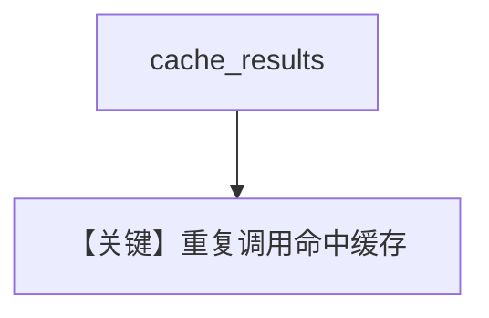

# cache_tool_calls.py — 实现原理分析

<!-- cookbook-py-source:start -->
## 完整源码

```python
"""
Cache Tool Calls
=============================

Demonstrates cache tool calls.
"""

import json

import httpx
from agno.agent import Agent
from agno.tools import tool

# ---------------------------------------------------------------------------
# Create Agent
# ---------------------------------------------------------------------------


@tool(stop_after_tool_call=True, cache_results=True)
def get_top_hackernews_stories(num_stories: int = 5) -> str:
    # Fetch top story IDs
    response = httpx.get("https://hacker-news.firebaseio.com/v0/topstories.json")
    story_ids = response.json()

    # Yield story details
    stories = []
    for story_id in story_ids[:num_stories]:
        story_response = httpx.get(
            f"https://hacker-news.firebaseio.com/v0/item/{story_id}.json"
        )
        story = story_response.json()
        if "text" in story:
            story.pop("text", None)
        stories.append(json.dumps(story))

    return "\n".join(stories)


agent = Agent(
    tools=[get_top_hackernews_stories],
    markdown=True,
)

# ---------------------------------------------------------------------------
# Run Agent
# ---------------------------------------------------------------------------
if __name__ == "__main__":
    agent.print_response("What are the top hackernews stories?", stream=True)
```

<!-- cookbook-py-source:end -->

> 源文件：`cookbook/91_tools/tool_decorator/cache_tool_calls.py`

## 概述

本示例展示 **`@tool(stop_after_tool_call=True, cache_results=True)`**：在拉取 HN 故事时 **结束后停止 agent 循环** 并 **缓存结果** 以避免重复请求。

**核心配置一览**

| 配置项 | 值 | 说明 |
|--------|------|------|
| `tools` | `[get_top_hackernews_stories]` |  |
| `markdown` | `True` |  |

## Mermaid 流程图


```mermaid
flowchart TD
    A["cache_results"] --> B["【关键】重复调用命中缓存"]
```

## 关键源码文件索引

| 文件 | 作用 |
|------|------|
| `agno/tools/function.py` | `cache_results` / `stop_after_tool_call` |
