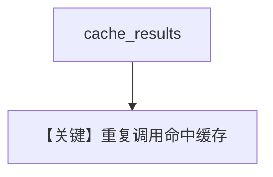

# cache_tool_calls.py — 实现原理分析

> 源文件：`cookbook/91_tools/tool_decorator/cache_tool_calls.py`

## 概述

本示例展示 **`@tool(stop_after_tool_call=True, cache_results=True)`**：在拉取 HN 故事时 **结束后停止 agent 循环** 并 **缓存结果** 以避免重复请求。

**核心配置一览**

| 配置项 | 值 | 说明 |
|--------|------|------|
| `tools` | `[get_top_hackernews_stories]` |  |
| `markdown` | `True` |  |

## Mermaid 流程图

```mermaid
flowchart TD
    A["cache_results"] --> B["【关键】重复调用命中缓存"]
```

## 关键源码文件索引

| 文件 | 作用 |
|------|------|
| `agno/tools/function.py` | `cache_results` / `stop_after_tool_call` |
