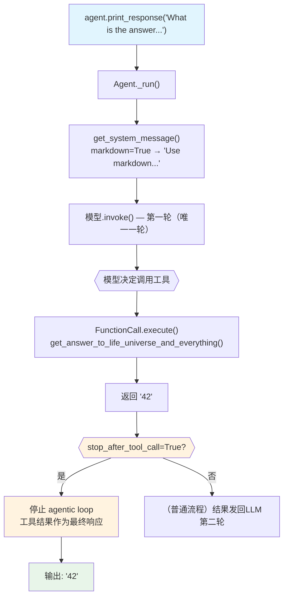

# stop_after_tool_call.py — 实现原理分析

> 源文件：`cookbook/91_tools/tool_decorator/stop_after_tool_call.py`

## 概述

本示例展示 Agno `@tool` 装饰器的 **`stop_after_tool_call`** 机制：工具执行完成后立即终止 Agent 的 agentic loop，不再将工具结果发回给 LLM 生成后续回答，直接将工具结果作为最终响应返回。

**核心配置一览：**

| 配置项 | 值 | 说明 |
|--------|------|------|
| `model` | `None` | 未显式设置 |
| `tools` | `[get_answer_to_life_universe_and_everything]` | `@tool(stop_after_tool_call=True)` |
| `markdown` | `True` | 输出 Markdown 格式 |
| `instructions` | `None` | 未设置 |
| `@tool stop_after_tool_call` | `True` | 工具执行后停止循环，工具结果直接作为响应 |

## 架构分层

```
用户代码层                      agno.agent 层
┌─────────────────────────┐    ┌────────────────────────────────────┐
│ stop_after_tool_call.py │    │ Agent._run()                       │
│                         │    │  ├─ 第一轮：模型调用工具            │
│ @tool(                  │    │  ├─ FunctionCall.execute()         │
│   stop_after_tool_call= │───>│  │   → function.stop_after_tool_   │
│   True                  │    │  │     call = True                 │
│ )                       │    │  │                                  │
│ def get_answer() -> str │    │  └─ 检测到 stop_after_tool_call    │
│   return "42"           │    │     → 停止循环，返回工具结果        │
└─────────────────────────┘    └────────────────────────────────────┘
                                              │
                                              ▼
                                    ┌──────────────────┐
                                    │ 默认模型          │
                                    │ (仅调用一轮)      │
                                    └──────────────────┘
```

## 核心组件解析

### stop_after_tool_call 机制

`Function.stop_after_tool_call = True` 在 `FunctionCall.execute()`（`function.py:976`）执行后被 Agent 的 `_run()` 检查：

```python
# agent/_run.py 中的 agentic loop 检查（简化）
for tool_call in tool_calls:
    result = tool_call.execute()
    if tool_call.function.stop_after_tool_call:
        # 立即终止循环
        run_response.content = result.result
        return run_response  # 直接返回工具结果
```

对比普通工具调用：工具结果会被追加到消息列表并发起第二轮 LLM 请求；`stop_after_tool_call=True` 时跳过第二轮请求。

| 场景 | 工具执行后 | LLM 调用次数 |
|------|----------|------------|
| 默认（`stop_after_tool_call=False`） | 结果发回 LLM，LLM 生成最终回答 | 2+ 轮 |
| `stop_after_tool_call=True` | 工具结果直接作为响应返回 | 1 轮 |

### 工具定义

```python
@tool(stop_after_tool_call=True)
def get_answer_to_life_universe_and_everything() -> str:
    """
    This returns the answer to the life, the universe and everything.
    """
    return "42"
```

函数无参数，LLM schema 中 `parameters` 为空对象，LLM 无需提供任何输入即可调用。

## System Prompt 组装

| 序号 | 组成部分 | 本文件中的值/来源 | 是否生效 |
|------|---------|-----------------|---------|
| 1 | `system_message` | `None` | 否 |
| 3.1 | `instructions` | `None` | 否 |
| 3.1.1 | 模型指令 | 模型特定指令 | 是 |
| 3.2.1 | `markdown` | `True` → "Use markdown to format your answers." | 是 |
| 3.3.5 | `_tool_instructions` | `None` | 否 |

### 最终 System Prompt

```text
Use markdown to format your answers.
```

## 完整 API 请求

第一轮（也是唯一一轮）模型调用：

```python
client.chat.completions.create(
    model="<default-model>",
    messages=[
        {"role": "system", "content": "Use markdown to format your answers."},
        {"role": "user", "content": "What is the answer to life, the universe and everything?"}
    ],
    tools=[
        {
            "type": "function",
            "function": {
                "name": "get_answer_to_life_universe_and_everything",
                "description": "This returns the answer to the life, the universe and everything.",
                "parameters": {"type": "object", "properties": {}, "required": []}
            }
        }
    ],
    stream=False
)
# 模型返回 tool_call → 执行工具 → 返回 "42" → stop_after_tool_call=True → 直接返回，不发起第二轮
```

## Mermaid 流程图



## 关键源码文件索引

| 文件 | 关键函数/类 | 作用 |
|------|------------|------|
| `agno/tools/decorator.py` | `tool()` L87 | `@tool` 装饰器 |
| `agno/tools/function.py` | `Function.stop_after_tool_call` L159 | 控制是否在工具调用后停止 |
| `agno/tools/function.py` | `FunctionCall.execute()` L976 | 执行工具函数 |
| `agno/agent/_run.py` | agentic loop | 检查 `stop_after_tool_call` 并终止循环 |
| `agno/agent/_messages.py` | `get_system_message()` L106 | 组装 system prompt |
