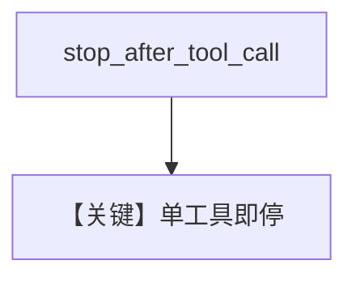

# stop_after_tool_call.py — 实现原理分析

> 源文件：`cookbook/91_tools/tool_decorator/stop_after_tool_call.py`

## 概述

本示例展示最小 **`@tool(stop_after_tool_call=True)`**：返回 `"42"` 后不再要求模型继续工具循环。

**核心配置一览**

| 配置项 | 值 | 说明 |
|--------|------|------|
| `tools` | `[get_answer_to_life_universe_and_everything]` |  |
| `markdown` | `True` |  |

## System Prompt 组装

含 markdown 段；无自定义 instructions。

## Mermaid 流程图

```mermaid
flowchart TD
    A["stop_after_tool_call"] --> B["【关键】单工具即停"]
```

## 关键源码文件索引

| 文件 | 作用 |
|------|------|
| `agno/agent/_run.py` | 工具循环终止逻辑 |
