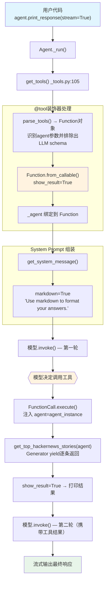

# tool_decorator.py — 实现原理分析

> 源文件：`cookbook/91_tools/tool_decorator/tool_decorator.py`

## 概述

本示例展示 Agno 的 **`@tool` 装饰器**机制：将普通 Python 函数（包括生成器）转换为 Agent 可调用的 `Function` 对象，支持 `show_result`、`agent` 参数注入（`dependencies` 访问）、同步生成器（`Iterator[str]`）流式返回，以及在 `Toolkit` 子类中对异步静态方法使用 `@tool`。

**核心配置一览：**

| 配置项 | 值 | 说明 |
|--------|------|------|
| `model` | `None` | 未显式设置，使用环境默认 |
| `dependencies` | `{"num_stories": 2}` | 工具通过 `agent.dependencies` 读取 |
| `tools` | `[get_top_hackernews_stories]` | `@tool(show_result=True)` 装饰的生成器函数 |
| `markdown` | `True` | 输出 Markdown 格式 |
| `instructions` | `None` | 未设置 |
| `@tool show_result` | `True` | 工具返回值直接打印到控制台 |
| `@tool` 函数签名 `agent: Agent` | 注入当前 Agent 实例 | 框架自动注入，不作为 LLM 参数 |

## 架构分层

```
用户代码层                      agno.agent 层
┌─────────────────────────┐    ┌────────────────────────────────────┐
│ tool_decorator.py       │    │ Agent._run()                       │
│                         │    │  ├─ get_tools()  _tools.py:105     │
│ @tool(show_result=True) │    │  │   parse_tools() → Function对象   │
│ def get_top_stories(    │───>│  │   _inject_agent_into_tools()     │
│   agent: Agent          │    │  │                                  │
│ ) -> Iterator[str]      │    │  ├─ get_system_message()            │
│                         │    │  │   → markdown="Use markdown..."   │
│ dependencies={          │    │  │                                  │
│   "num_stories": 2      │    │  └─ FunctionCall.execute()         │
│ }                       │    │      → function.entrypoint(**args)  │
└─────────────────────────┘    │      → yield逐条返回               │
                               └────────────────────────────────────┘
                                              │
                                              ▼
                                    ┌──────────────────┐
                                    │ 默认模型          │
                                    │ (OpenAIChat等)   │
                                    └──────────────────┘
```

## 核心组件解析

### @tool 装饰器

`@tool` 定义在 `agno/tools/decorator.py:87`，将普通函数包装为 `Function` 实例：

```python
# decorator.py:87 关键流程
def tool(*args, **kwargs):
    # 支持三种调用形式：
    # @tool           → func直接作为位置参数
    # @tool()         → 无参装饰器
    # @tool(show_result=True, ...) → 带参装饰器
    
    func = Function.from_callable(
        entrypoint=original_func,
        show_result=show_result,      # 控制是否打印结果
        stop_after_tool_call=...,     # 工具调用后停止
        instructions=...,             # 注入 system prompt
        pre_hook=..., post_hook=...,  # 函数级 hook
        cache_results=...,            # 结果缓存
    )
```

### agent 参数注入

工具函数签名中的 `agent: Agent` 参数在 `parse_tools()` 阶段（`_tools.py:350`）由框架自动识别并绑定，**不会**作为 LLM 的函数参数传递：

```python
# 工具函数中访问 dependencies
def get_top_hackernews_stories(agent: Agent) -> Iterator[str]:
    num_stories = agent.dependencies.get("num_stories", 5) if agent.dependencies else 5
    # ...
```

框架在 `Function.from_callable()` 中分析函数签名，识别 `agent`/`run_context`/`team` 等特殊参数并从 LLM schema 中排除。

### Generator 工具（Iterator[str]）

返回 `Iterator[str]` 的生成器函数在 `FunctionCall.execute()` 中被特殊处理：每次 `yield` 的字符串会追加到结果缓冲区，最终合并为单条工具结果返回给 LLM。

### 异步静态方法变体（Async Variant）

```python
class DemoTools:
    @tool(description="Get the top hackernews stories")
    @staticmethod
    async def get_top_hackernews_stories(agent: Agent):
        # async with httpx.AsyncClient() as client: ...
        pass

# 使用实例方法注册
agent = Agent(tools=[DemoTools.get_top_hackernews_stories])
asyncio.run(agent.aprint_response(...))
```

`@tool` 在 `_is_async_function()` 中通过检查 `__code__.co_flags & 0x80`（`CO_COROUTINE`）识别异步函数，将 `Function.is_async` 设为 `True`，在 `aget_tools()` 路径中使用异步执行器。

## System Prompt 组装

| 序号 | 组成部分 | 本文件中的值/来源 | 是否生效 |
|------|---------|-----------------|---------|
| 1 | `system_message`（自定义） | `None` | 否 |
| 3.1 | `instructions` | `None` | 否 |
| 3.1.1 | 模型指令（`get_instructions_for_model`） | 模型特定指令 | 是 |
| 3.2.1 | `markdown` | `True` → "Use markdown to format your answers." | 是 |
| 3.2.2 | `add_datetime_to_context` | `False` | 否 |
| 3.2.3 | `add_location_to_context` | `False` | 否 |
| 3.2.4 | `add_name_to_context` | `False` | 否 |
| 3.3.5 | `_tool_instructions` | `None`（@tool未设置instructions） | 否 |
| 3.3.7 | `expected_output` | `None` | 否 |

### 最终 System Prompt

```text
Use markdown to format your answers.
```

## 完整 API 请求

```python
client.chat.completions.create(
    model="<default-model>",
    messages=[
        {"role": "system", "content": "Use markdown to format your answers."},
        {"role": "user", "content": "What are the top hackernews stories?"}
    ],
    tools=[
        {
            "type": "function",
            "function": {
                "name": "get_top_hackernews_stories",
                "description": "...",  # 从函数 docstring 提取
                "parameters": {
                    "type": "object",
                    "properties": {},   # agent参数被排除
                    "required": []
                }
            }
        }
    ],
    stream=True,
    stream_options={"include_usage": True}
)
```

工具调用后第二轮请求（携带工具结果）：

```python
client.chat.completions.create(
    model="<default-model>",
    messages=[
        {"role": "system", "content": "Use markdown to format your answers."},
        {"role": "user", "content": "What are the top hackernews stories?"},
        {"role": "assistant", "tool_calls": [{"id": "call_xxx", "function": {"name": "get_top_hackernews_stories", "arguments": "{}"}}]},
        {"role": "tool", "tool_call_id": "call_xxx", "content": "<合并后的故事JSON>"}
    ],
    stream=True
)
```

## Mermaid 流程图



## 关键源码文件索引

| 文件 | 关键函数/类 | 作用 |
|------|------------|------|
| `agno/tools/decorator.py` | `tool()` L87 | `@tool` 装饰器入口，创建 Function 对象 |
| `agno/tools/function.py` | `Function` L130+ | 工具函数的核心数据模型 |
| `agno/tools/function.py` | `Function.from_callable()` | 将 Python 函数转换为 Function |
| `agno/agent/_tools.py` | `get_tools()` L105 | 收集并解析所有工具 |
| `agno/agent/_tools.py` | `parse_tools()` L350 | 分析函数签名，排除特殊参数 |
| `agno/agent/_messages.py` | `get_system_message()` L106 | 组装 system prompt |
