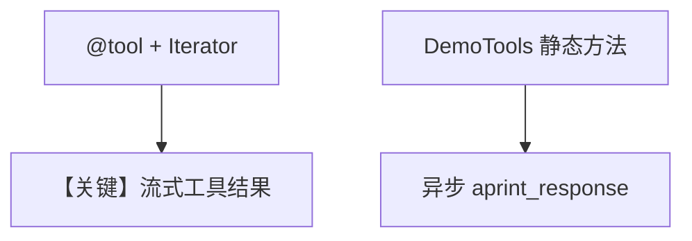

# tool_decorator.py — 实现原理分析

> 源文件：`cookbook/91_tools/tool_decorator/tool_decorator.py`

## 概述

本文件包含 **两段可执行演示**：(1) 同步 **`@tool(show_result=True)`** 与 **生成器** `Iterator[str]` 流式产出故事；(2) `if __name__` 内嵌 **asyncio** 与 **`DemoTools`** 静态异步工具（仅注册部分方法到 Agent）。

**核心配置一览（首段 `agent`）**

| 配置项 | 值 | 说明 |
|--------|------|------|
| `dependencies` | `{"num_stories": 2}` |  |
| `tools` | `[get_top_hackernews_stories]` | 生成器 + `@tool` |
| `markdown` | `True` |  |

## 运行机制与因果链

第二段在 `__main__` 中 **重新赋值** `agent` 并 `asyncio.run`，演示 **静态 `@tool` 方法** 与 **独立 Weather 工具**；注意同一文件内多次构造 Agent，符合「脚本示例集合」而非单一长期 Agent。

## Mermaid 流程图

```mermaid
flowchart TD
    A["@tool + Iterator"] --> B["【关键】流式工具结果"]
    C["DemoTools 静态方法"] --> D["异步 aprint_response"]
```

## 关键源码文件索引

| 文件 | 作用 |
|------|------|
| `agno/tools/` | `@tool` 装饰器 |
