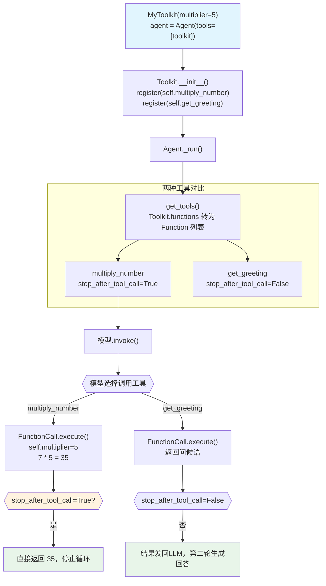

# tool_decorator_on_class_method.py — 实现原理分析

> 源文件：`cookbook/91_tools/tool_decorator/tool_decorator_on_class_method.py`

## 概述

本示例展示在 **`Toolkit` 子类的实例方法上使用 `@tool` 装饰器**的机制：`@tool` 可装饰实例方法（访问 `self`）、生成器方法（`Generator[str]`），并与 `stop_after_tool_call` 组合。演示了通过 `tools=[self.method1, self.method2]` 传入 Toolkit 构造函数注册工具的方式。

**核心配置一览：**

| 配置项 | 值 | 说明 |
|--------|------|------|
| `model` | `None` | 未显式设置 |
| `tools` | `[toolkit]` | MyToolkit 实例，内含 2 个 @tool 方法 |
| `markdown` | `True` | 输出 Markdown 格式 |
| `MyToolkit.multiplier` | `5`（自定义） | 通过 `self` 访问的实例状态 |
| `@tool stop_after_tool_call` | `True`（部分方法） | `multiply_number` 调用后停止 |
| `ToolkitWithGenerator` | `Generator[str]` | 生成器方法示例 |

## 架构分层

```
用户代码层                         agno.agent 层
┌──────────────────────────────┐   ┌─────────────────────────────────────┐
│ tool_decorator_on_class_     │   │ Agent._run()                        │
│ method.py                    │   │  ├─ get_tools()                     │
│                              │   │  │   Toolkit.__iter__()              │
│ class MyToolkit(Toolkit):    │   │  │   → 解析 tools=[self.multiply,   │
│   @tool(stop_after_=True)   │──>│  │          self.get_greeting]       │
│   def multiply_number(self)  │   │  │   → 绑定 self 到方法             │
│                              │   │  │                                  │
│   @tool()                    │   │  ├─ get_system_message()            │
│   def get_greeting(self, ..) │   │  │                                  │
│                              │   │  └─ FunctionCall.execute()         │
│ toolkit = MyToolkit(mult=5)  │   │      → toolkit.multiply_number()   │
└──────────────────────────────┘   └─────────────────────────────────────┘
                                                 │
                                                 ▼
                                       ┌──────────────────┐
                                       │ 默认模型          │
                                       └──────────────────┘
```

## 核心组件解析

### Toolkit 初始化与工具注册

```python
class MyToolkit(Toolkit):
    def __init__(self, multiplier: int = 2):
        self.multiplier = multiplier
        # 通过 tools 参数将已绑定的方法传入 Toolkit
        super().__init__(
            name="my_toolkit",
            tools=[
                self.multiply_number,   # 已绑定实例的方法
                self.get_greeting,
            ],
        )
```

`Toolkit.__init__()` 在 `tools/toolkit.py:15-80` 中处理 `tools` 列表：对每个 callable 调用 `register()`，而 `@tool` 装饰后的方法已经是 `Function` 对象（或可转换为 Function），`register()` 将其加入 `self.functions` 字典。

### @tool 在类方法上的绑定

```python
@tool(stop_after_tool_call=True)
def multiply_number(self, number: int) -> int:
    """Multiply a number by the toolkit's multiplier."""
    return number * self.multiplier   # 通过 self 访问实例状态
```

`@tool` 装饰后，方法依然是类的方法，`self` 由 Python 的描述符协议正常绑定。当 `Toolkit` 用 `self.multiply_number` 传入时，已是绑定方法（bound method），框架在 `from_callable()` 中正确处理 `self` 参数（从 LLM schema 排除）。

### Generator 方法

```python
class ToolkitWithGenerator(Toolkit):
    @tool(stop_after_tool_call=True)
    def stream_numbers(self, count: int) -> Generator[str, None, None]:
        for i in range(1, count + 1):
            yield f"Number: {i}"
```

与顶层生成器函数相同，`Generator[str]` 的 `yield` 返回值被合并为单条工具结果。

### 注册结果验证

```python
toolkit = MyToolkit(multiplier=5)
# 打印注册情况
for name, func in toolkit.functions.items():
    print(f"  {name}: stop_after_tool_call={func.stop_after_tool_call}")
# 输出：
#   multiply_number: stop_after_tool_call=True
#   get_greeting: stop_after_tool_call=False
```

## System Prompt 组装

| 序号 | 组成部分 | 本文件中的值/来源 | 是否生效 |
|------|---------|-----------------|---------|
| 1 | `system_message` | `None` | 否 |
| 3.1 | `instructions` | `None` | 否 |
| 3.1.1 | 模型指令 | 模型特定指令 | 是 |
| 3.2.1 | `markdown` | `True` → "Use markdown to format your answers." | 是 |
| 3.3.5 | `_tool_instructions` | `None`（@tool 未设置 instructions） | 否 |

### 最终 System Prompt

```text
Use markdown to format your answers.
```

## 完整 API 请求

```python
# 调用 multiply_number 时的请求
client.chat.completions.create(
    model="<default-model>",
    messages=[
        {"role": "system", "content": "Use markdown to format your answers."},
        {"role": "user", "content": "What is 7 multiplied by the multiplier?"}
    ],
    tools=[
        {
            "type": "function",
            "function": {
                "name": "multiply_number",
                "description": "Multiply a number by the toolkit's multiplier.",
                "parameters": {
                    "type": "object",
                    "properties": {
                        "number": {"type": "integer", "description": "The number to multiply"}
                    },
                    "required": ["number"]
                    # self 参数被排除
                }
            }
        },
        {
            "type": "function",
            "function": {
                "name": "get_greeting",
                "description": "Get a greeting message.",
                "parameters": {
                    "type": "object",
                    "properties": {
                        "name": {"type": "string", "description": "The name to greet"}
                    },
                    "required": ["name"]
                }
            }
        }
    ],
    stream=False
)
# 模型调用 multiply_number(number=7) → 返回 35 → stop_after_tool_call=True → 停止
```

## Mermaid 流程图



## 关键源码文件索引

| 文件 | 关键函数/类 | 作用 |
|------|------------|------|
| `agno/tools/toolkit.py` | `Toolkit.__init__()` L15-80 | 处理 tools 列表，调用 register() |
| `agno/tools/toolkit.py` | `Toolkit.register()` | 将 callable 注册为 Function |
| `agno/tools/decorator.py` | `tool()` L87 | 装饰实例方法，处理 self 绑定 |
| `agno/tools/function.py` | `Function.stop_after_tool_call` L159 | 控制是否工具调用后停止 |
| `agno/agent/_tools.py` | `parse_tools()` L350 | 排除 self 参数出 LLM schema |
