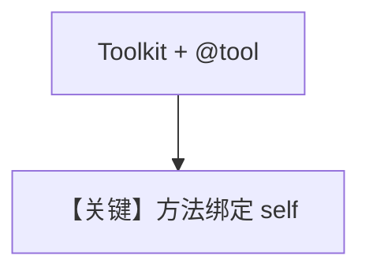

# tool_decorator_on_class_method.py — 实现原理分析

<!-- cookbook-py-source:start -->
## 完整源码

```python
"""
Tool Decorator On Class Method
=============================

Demonstrates tool decorator on class method.
"""

from typing import Generator

from agno.agent import Agent
from agno.tools import Toolkit, tool

# ---------------------------------------------------------------------------
# Create Agent
# ---------------------------------------------------------------------------


class MyToolkit(Toolkit):
    def __init__(self, multiplier: int = 2):
        """Initialize the toolkit with a configurable multiplier."""
        self.multiplier = multiplier

        # Initialize Toolkit with the decorated methods
        # The @tool decorator creates Function objects that will be properly bound to self
        super().__init__(
            name="my_toolkit",
            tools=[
                self.multiply_number,
                self.get_greeting,
            ],
        )

    @tool(stop_after_tool_call=True)
    def multiply_number(self, number: int) -> int:
        """
        Multiply a number by the toolkit's multiplier.
        Args:
            number: The number to multiply
        Returns:
            The multiplied result
        """
        return number * self.multiplier

    @tool()
    def get_greeting(self, name: str) -> str:
        """
        Get a greeting message.
        Args:
            name: The name to greet
        Returns:
            A greeting message
        """
        return f"Hello, {name}! The multiplier is {self.multiplier}."


class ToolkitWithGenerator(Toolkit):
    """Example toolkit with a generator method."""

    def __init__(self):
        super().__init__(
            name="generator_toolkit",
            tools=[self.stream_numbers],
        )

    @tool(stop_after_tool_call=True)
    def stream_numbers(self, count: int) -> Generator[str, None, None]:
        """
        Stream numbers from 1 to count.
        Args:
            count: How many numbers to stream
        Returns:
            A generator yielding numbers
        """
        for i in range(1, count + 1):
            yield f"Number: {i}"


# ---------------------------------------------------------------------------
# Run Agent
# ---------------------------------------------------------------------------

if __name__ == "__main__":
    # Create toolkit with custom multiplier
    toolkit = MyToolkit(multiplier=5)

    # Verify the functions are registered correctly
    print("Registered functions:")
    for name, func in toolkit.functions.items():
        print(
            f"  {name}: stop_after_tool_call={func.stop_after_tool_call}, show_result={func.show_result}"
        )

    # Create agent with the toolkit
    agent = Agent(
        tools=[toolkit],
        markdown=True,
    )

    # Test the multiply_number tool (should stop after tool call)
    print("\n--- Testing multiply_number (stop_after_tool_call=True) ---")
    agent.print_response("What is 7 multiplied by the multiplier?")

    # Test the get_greeting tool
    print("\n--- Testing get_greeting ---")
    agent.print_response("Greet me, my name is Alice")
```

<!-- cookbook-py-source:end -->

> 源文件：`cookbook/91_tools/tool_decorator/tool_decorator_on_class_method.py`

## 概述

本示例展示 **`Toolkit` 子类** 内在方法上使用 **`@tool`**（含 **`stop_after_tool_call=True`**）与 **生成器** `stream_numbers`。

**核心配置一览（运行段）**

| 配置项 | 值 | 说明 |
|--------|------|------|
| `tools` | `[toolkit]` 其中 `MyToolkit` / `ToolkitWithGenerator` |  |
| `markdown` | `True` |  |

## Mermaid 流程图


```mermaid
flowchart TD
    A["Toolkit + @tool"] --> B["【关键】方法绑定 self"]
```

## 关键源码文件索引

| 文件 | 作用 |
|------|------|
| `agno/tools/toolkit.py` | `Toolkit` |
