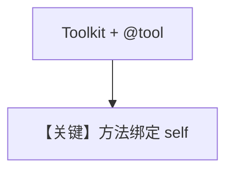

# tool_decorator_on_class_method.py — 实现原理分析

> 源文件：`cookbook/91_tools/tool_decorator/tool_decorator_on_class_method.py`

## 概述

本示例展示 **`Toolkit` 子类** 内在方法上使用 **`@tool`**（含 **`stop_after_tool_call=True`**）与 **生成器** `stream_numbers`。

**核心配置一览（运行段）**

| 配置项 | 值 | 说明 |
|--------|------|------|
| `tools` | `[toolkit]` 其中 `MyToolkit` / `ToolkitWithGenerator` |  |
| `markdown` | `True` |  |

## Mermaid 流程图

```mermaid
flowchart TD
    A["Toolkit + @tool"] --> B["【关键】方法绑定 self"]
```

## 关键源码文件索引

| 文件 | 作用 |
|------|------|
| `agno/tools/toolkit.py` | `Toolkit` |
