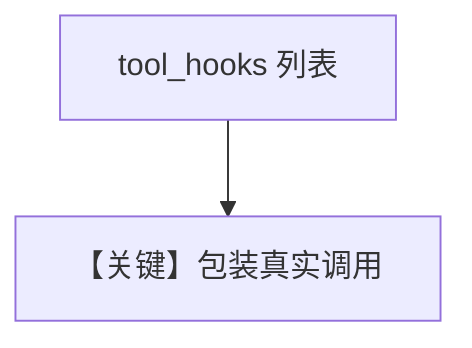

# tool_decorator_with_hook.py — 实现原理分析

<!-- cookbook-py-source:start -->
## 完整源码

```python
"""Show how to decorate a custom hook with a tool execution hook."""

import json
import time
from typing import Any, Callable, Dict

import httpx
from agno.agent import Agent
from agno.tools import tool
from agno.utils.log import logger

# ---------------------------------------------------------------------------
# Create Agent
# ---------------------------------------------------------------------------


def duration_logger_hook(
    function_name: str, function_call: Callable, arguments: Dict[str, Any]
):
    """Log the duration of the function call"""
    start_time = time.time()

    result = function_call(**arguments)

    end_time = time.time()
    duration = end_time - start_time
    logger.info(f"Function {function_name} took {duration:.2f} seconds to execute")
    return result


@tool(tool_hooks=[duration_logger_hook])
def get_top_hackernews_stories(agent: Agent) -> str:
    num_stories = agent.dependencies.get("num_stories", 5) if agent.dependencies else 5

    # Fetch top story IDs
    response = httpx.get("https://hacker-news.firebaseio.com/v0/topstories.json")
    story_ids = response.json()

    final_stories = {}
    for story_id in story_ids[:num_stories]:
        story_response = httpx.get(
            f"https://hacker-news.firebaseio.com/v0/item/{story_id}.json"
        )
        story = story_response.json()
        if "text" in story:
            story.pop("text", None)
        final_stories[story_id] = story

    return json.dumps(final_stories)


agent = Agent(
    dependencies={
        "num_stories": 2,
    },
    tools=[get_top_hackernews_stories],
    markdown=True,
)

# ---------------------------------------------------------------------------
# Run Agent
# ---------------------------------------------------------------------------
if __name__ == "__main__":
    agent.print_response("What are the top hackernews stories?", stream=True)
```

<!-- cookbook-py-source:end -->

> 源文件：`cookbook/91_tools/tool_decorator/tool_decorator_with_hook.py`

## 概述

本示例展示 **`@tool(tool_hooks=[duration_logger_hook])`**：`duration_logger_hook` 为 **(function_name, function_call, arguments)** 形态，在调用前后计时并写日志。

**核心配置一览**

| 配置项 | 值 | 说明 |
|--------|------|------|
| `dependencies` | `{"num_stories": 2}` |  |
| `tools` | `[get_top_hackernews_stories]` |  |
| `markdown` | `True` |  |

## Mermaid 流程图



## 关键源码文件索引

| 文件 | 作用 |
|------|------|
| `agno/tools/function.py` | per-tool hooks |
