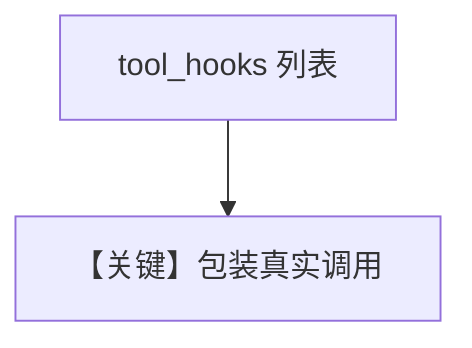

# tool_decorator_with_hook.py — 实现原理分析

> 源文件：`cookbook/91_tools/tool_decorator/tool_decorator_with_hook.py`

## 概述

本示例展示 **`@tool(tool_hooks=[duration_logger_hook])`**：`duration_logger_hook` 为 **(function_name, function_call, arguments)** 形态，在调用前后计时并写日志。

**核心配置一览**

| 配置项 | 值 | 说明 |
|--------|------|------|
| `dependencies` | `{"num_stories": 2}` |  |
| `tools` | `[get_top_hackernews_stories]` |  |
| `markdown` | `True` |  |

## Mermaid 流程图

## 关键源码文件索引

| 文件 | 作用 |
|------|------|
| `agno/tools/function.py` | per-tool hooks |
