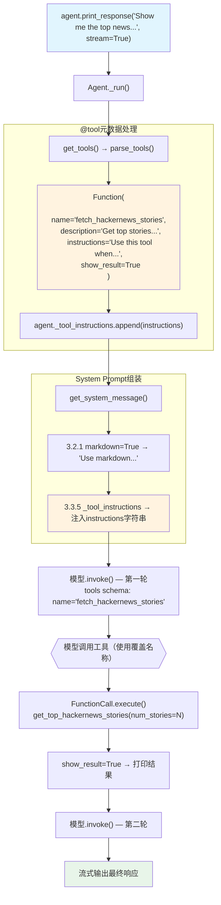

# tool_decorator_with_instructions.py — 实现原理分析

> 源文件：`cookbook/91_tools/tool_decorator/tool_decorator_with_instructions.py`

## 概述

本示例展示 **`@tool` 装饰器的 `instructions` 参数**机制：通过 `name`、`description`、`instructions`、`show_result` 完全自定义工具的 LLM 元数据和 system prompt 注入内容。`instructions` 字符串会在 system prompt 的 **步骤 3.3.5** 位置（`_tool_instructions`）注入，指导 LLM 何时以及如何使用该工具。

**核心配置一览：**

| 配置项 | 值 | 说明 |
|--------|------|------|
| `model` | `None` | 未显式设置 |
| `tools` | `[get_top_hackernews_stories]` | 带完整元数据的 @tool 函数 |
| `markdown` | `True` | 输出 Markdown 格式 |
| `@tool name` | `"fetch_hackernews_stories"` | 覆盖 LLM schema 中的函数名 |
| `@tool description` | `"Get top stories from Hacker News"` | 覆盖 LLM schema 中的函数描述 |
| `@tool show_result` | `True` | 工具结果直接打印 |
| `@tool instructions` | 多行字符串，说明何时使用本工具 | 注入到 system prompt 步骤 3.3.5 |

## 架构分层

```
用户代码层                      agno.agent 层
┌─────────────────────────┐    ┌────────────────────────────────────┐
│ tool_decorator_with_    │    │ Agent._run()                       │
│ instructions.py         │    │  ├─ get_tools() → parse_tools()    │
│                         │    │  │   Function(                     │
│ @tool(                  │    │  │     name="fetch_hackernews...", │
│   name="fetch_hacker..",│───>│  │     description="Get top...",   │
│   description="...",    │    │  │     instructions="Use this..."  │
│   show_result=True,     │    │  │   )                             │
│   instructions="..."    │    │  │                                  │
│ )                       │    │  ├─ get_system_message()           │
│ def get_top_stories():  │    │  │   步骤3.3.5: _tool_instructions  │
│   return stories_str    │    │  │   → 注入 instructions 字符串    │
└─────────────────────────┘    └────────────────────────────────────┘
                                              │
                                              ▼
                                    ┌──────────────────┐
                                    │ 默认模型          │
                                    └──────────────────┘
```

## 核心组件解析

### @tool instructions 注入

`@tool(instructions=...)` 中的 `instructions` 字符串通过 `Function.instructions` 属性存储。在 `get_tools()` 后，Agent 的 `_tool_instructions` 列表收集所有工具的 instructions：

```python
# _tools.py 中（简化）
for func in parsed_tools:
    if func.instructions and func.add_instructions:
        agent._tool_instructions = agent._tool_instructions or []
        agent._tool_instructions.append(func.instructions)
```

然后在 `get_system_message()` 的步骤 3.3.5（`_messages.py:258-260`）注入到 system prompt：

```python
# _messages.py:258
if agent._tool_instructions is not None:
    for _ti in agent._tool_instructions:
        system_message_content += f"{_ti}\n"
```

### name/description 覆盖

```python
@tool(
    name="fetch_hackernews_stories",      # 覆盖 LLM 看到的函数名
    description="Get top stories from Hacker News",  # 覆盖函数描述
    show_result=True,
    instructions="...",
)
def get_top_hackernews_stories(num_stories: int = 5) -> str:
    ...
```

LLM 的 tools schema 中将使用 `name` 和 `description` 覆盖值，而非从函数名/docstring 自动提取。

### add_instructions 控制

`Function.add_instructions = True`（默认）：`instructions` 注入到 system prompt。
如设为 `False`，则 `instructions` 仅在 Function 对象中存储但不影响 system prompt。

## System Prompt 组装

| 序号 | 组成部分 | 本文件中的值/来源 | 是否生效 |
|------|---------|-----------------|---------|
| 1 | `system_message` | `None` | 否 |
| 3.1 | `instructions` | `None` | 否 |
| 3.1.1 | 模型指令 | 模型特定指令 | 是 |
| 3.2.1 | `markdown` | `True` → "Use markdown to format your answers." | 是 |
| 3.3.5 | `_tool_instructions` | `@tool(instructions=...)` 的多行字符串 | **是** |
| 3.3.7 | `expected_output` | `None` | 否 |

### 最终 System Prompt

```text
Use markdown to format your answers.

        Use this tool when:
          1. The user wants to see recent popular tech news or discussions
          2. You need examples of trending technology topics
          3. The user asks for Hacker News content or tech industry stories

        The tool will return titles and URLs for the specified number of top stories. When presenting results:
          - Highlight interesting or unusual stories
          - Summarize key themes if multiple stories are related
          - If summarizing, mention the original source is Hacker News
```

## 完整 API 请求

```python
client.chat.completions.create(
    model="<default-model>",
    messages=[
        {"role": "system", "content": "Use markdown to format your answers.\n\n        Use this tool when:\n          1. The user wants to see recent popular tech news..."},
        {"role": "user", "content": "Show me the top news from Hacker News and summarize them"}
    ],
    tools=[
        {
            "type": "function",
            "function": {
                "name": "fetch_hackernews_stories",          # 使用覆盖名称
                "description": "Get top stories from Hacker News",  # 使用覆盖描述
                "parameters": {
                    "type": "object",
                    "properties": {
                        "num_stories": {"type": "integer", "default": 5}
                    },
                    "required": []
                }
            }
        }
    ],
    stream=True,
    stream_options={"include_usage": True}
)
```

## Mermaid 流程图



## 关键源码文件索引

| 文件 | 关键函数/类 | 作用 |
|------|------------|------|
| `agno/tools/decorator.py` | `tool()` L87 | 解析 name/description/instructions 参数 |
| `agno/tools/function.py` | `Function.instructions` L147 | 存储工具使用说明 |
| `agno/tools/function.py` | `Function.add_instructions` L150 | 控制是否注入 system prompt |
| `agno/agent/_tools.py` | `parse_tools()` L350 | 收集 `_tool_instructions` |
| `agno/agent/_messages.py` | 步骤 3.3.5 L258-260 | 将 `_tool_instructions` 注入 system prompt |
