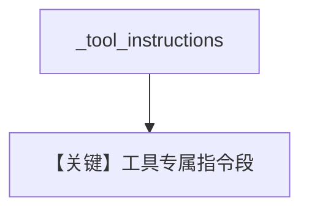

# tool_decorator_with_instructions.py — 实现原理分析

<!-- cookbook-py-source:start -->
## 完整源码

```python
"""
Tool Decorator With Instructions
=============================

Demonstrates tool decorator with instructions.
"""

import httpx
from agno.agent import Agent
from agno.tools import tool

# ---------------------------------------------------------------------------
# Create Agent
# ---------------------------------------------------------------------------


@tool(
    name="fetch_hackernews_stories",
    description="Get top stories from Hacker News",
    show_result=True,
    instructions="""
        Use this tool when:
          1. The user wants to see recent popular tech news or discussions
          2. You need examples of trending technology topics
          3. The user asks for Hacker News content or tech industry stories

        The tool will return titles and URLs for the specified number of top stories. When presenting results:
          - Highlight interesting or unusual stories
          - Summarize key themes if multiple stories are related
          - If summarizing, mention the original source is Hacker News
    """,
)
def get_top_hackernews_stories(num_stories: int = 5) -> str:
    response = httpx.get("https://hacker-news.firebaseio.com/v0/topstories.json")
    story_ids = response.json()

    # Get story details
    stories = []
    for story_id in story_ids[:num_stories]:
        story_response = httpx.get(
            f"https://hacker-news.firebaseio.com/v0/item/{story_id}.json"
        )
        story = story_response.json()
        stories.append(f"{story.get('title')} - {story.get('url', 'No URL')}")

    return "\n".join(stories)


agent = Agent(
    tools=[get_top_hackernews_stories],
    markdown=True,
)

# ---------------------------------------------------------------------------
# Run Agent
# ---------------------------------------------------------------------------
if __name__ == "__main__":
    agent.print_response(
        "Show me the top news from Hacker News and summarize them", stream=True
    )
```

<!-- cookbook-py-source:end -->

> 源文件：`cookbook/91_tools/tool_decorator/tool_decorator_with_instructions.py`

## 概述

本示例展示 **`@tool` 的 `name`/`description`/`instructions`/`show_result`**：为 HN 拉取工具提供 **额外工具级指令**（何时调用、如何呈现）。

**核心配置一览**

| 配置项 | 值 | 说明 |
|--------|------|------|
| `tools` | `[get_top_hackernews_stories]` | `name="fetch_hackernews_stories"` 等 |
| `markdown` | `True` |  |

## System Prompt 组装

工具级 `instructions` 进入 **`agent._tool_instructions`** 段（`# 3.3.5`，`agno/agent/_messages.py`）。

### 还原后的完整 System 文本（工具 instructions 字面量）

```text

        Use this tool when:
          1. The user wants to see recent popular tech news or discussions
          2. You need examples of trending technology topics
          3. The user asks for Hacker News content or tech industry stories

        The tool will return titles and URLs for the specified number of top stories. When presenting results:
          - Highlight interesting or unusual stories
          - Summarize key themes if multiple stories are related
          - If summarizing, mention the original source is Hacker News
    
```

（前后另有 markdown 段与其它工具说明；以上为 `@tool(instructions=...)` 原样核心。）

## Mermaid 流程图


```mermaid
flowchart TD
    A["_tool_instructions"] --> B["【关键】工具专属指令段"]
```

## 关键源码文件索引

| 文件 | 作用 |
|------|------|
| `agno/agent/_messages.py` | `# 3.3.5` |
