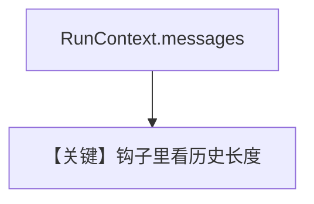

# message_history_in_hooks.py — 实现原理分析

> 源文件：`cookbook/91_tools/tool_hooks/message_history_in_hooks.py`

## 概述

本示例展示 **`@tool(pre_hook=..., post_hook=...)`** 中钩子接收 **`RunContext`**，通过 **`run_context.messages`** 读取 **当前 run 内消息条数**，用于调试/观测。

**核心配置一览**

| 配置项 | 值 | 说明 |
|--------|------|------|
| `model` | `OpenAIChat(id="gpt-4o-mini")` |  |
| `tools` | `[get_weather]` |  |
| `instructions` | `["Use the tools to help the user."]` |  |

## 运行机制与因果链

pre/post 在工具执行前后打印消息计数；**不**改变工具返回值逻辑。

## Mermaid 流程图

## 关键源码文件索引

| 文件 | 作用 |
|------|------|
| `agno/run/base.py` | `RunContext` |
