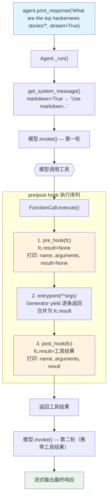

# pre_and_post_hooks.py — 实现原理分析

> 源文件：`cookbook/91_tools/tool_hooks/pre_and_post_hooks.py`

## 概述

本示例展示 **函数级 `pre_hook`/`post_hook`** 机制（通过 `@tool(pre_hook=..., post_hook=...)` 配置）：不同于 Agent 级 `tool_hooks` 拦截所有工具，`pre_hook`/`post_hook` 仅作用于单个工具函数。hook 接收 `FunctionCall` 实例，可访问函数名、参数、执行结果。支持同步和异步变体。

**核心配置一览：**

| 配置项 | 值 | 说明 |
|--------|------|------|
| `model` | `None` | 未显式设置 |
| `tools` | `[get_top_hackernews_stories]` | 带 pre/post hook 的工具 |
| `markdown` | `True` | Markdown 格式化 |
| `dependencies` | `{"num_stories": 2}` | 工具参数 |
| `@tool pre_hook` | `pre_hook(fc: FunctionCall)` | 工具执行前调用 |
| `@tool post_hook` | `post_hook(fc: FunctionCall)` | 工具执行后调用 |
| 异步变体 | `async def pre/post_hook_async` | AsyncFunctionCall 路径 |

## 架构分层

```
用户代码层                      agno.agent 层
┌─────────────────────────┐    ┌────────────────────────────────────┐
│ pre_and_post_hooks.py   │    │ Agent._run()                       │
│                         │    │  └─ FunctionCall.execute()         │
│ def pre_hook(fc):       │    │      ├─ 1. pre_hook(FunctionCall)  │
│   print(fc.function.name│───>│      │     fc.result = None        │
│   print(fc.arguments)   │    │      │                              │
│   print(fc.result)      │    │      ├─ 2. entrypoint(**args)      │
│                         │    │      │     生成器 yield 返回        │
│ def post_hook(fc):      │    │      │                              │
│   print(fc.function.name│    │      └─ 3. post_hook(FunctionCall) │
│   print(fc.result)      │    │           fc.result = 工具结果     │
└─────────────────────────┘    └────────────────────────────────────┘
```

## 核心组件解析

### pre_hook 与 post_hook 的触发时机

```python
def pre_hook(fc: FunctionCall):
    print(f"Pre-hook: {fc.function.name}")   # 工具名
    print(f"Arguments: {fc.arguments}")       # 模型传入的参数
    print(f"Result: {fc.result}")             # 此时 result=None（工具未执行）

def post_hook(fc: FunctionCall):
    print(f"Post-hook: {fc.function.name}")
    print(f"Arguments: {fc.arguments}")
    print(f"Result: {fc.result}")             # 此时 result=工具执行结果
```

`FunctionCall.execute()` 的执行顺序（`function.py:976` 简化）：

```python
def execute(self) -> FunctionExecutionResult:
    # 1. 执行 pre_hook（如果有）
    if self.function.pre_hook:
        self.function.pre_hook(self)  # self 就是 FunctionCall 实例
    
    # 2. 执行工具函数
    result = self.function.entrypoint(**args)
    self.result = result  # 更新 FunctionCall.result
    
    # 3. 执行 post_hook（如果有）
    if self.function.post_hook:
        self.function.post_hook(self)
    
    return FunctionExecutionResult(result=self.result)
```

### 与 Agent 级 tool_hooks 的区别

| 特性 | `@tool(pre_hook, post_hook)` | `Agent(tool_hooks=[...])` |
|------|------------------------------|--------------------------|
| 作用域 | 单个工具函数 | 所有工具 |
| 接收参数 | `FunctionCall` 实例（含 fc.result） | `function_name`, `function_call`, `arguments` |
| 能否修改结果 | 是（修改 `fc.result`） | 是（hook 包裹并返回新结果） |
| 能否阻止执行 | pre_hook 抛异常可阻止 | hook 不调用 `function_call` 可阻止 |
| 执行位置 | 在 entrypoint 调用前/后 | 包裹 entrypoint，控制是否调用 |

### 异步变体

```python
async def pre_hook_async(fc: FunctionCall):
    print(f"About to run: {fc.function.name}")

async def post_hook_async(fc: FunctionCall):
    print("After running: ", fc.function.name)

@tool(show_result=True, pre_hook=pre_hook_async, post_hook=post_hook_async)
async def get_top_hackernews_stories_async(agent: Agent) -> AsyncIterator[str]:
    ...

async_agent = Agent(
    dependencies={"num_stories": 2},
    tools=[get_top_hackernews_stories_async],
    markdown=True,
)
asyncio.run(async_agent.aprint_response("..."))
```

异步 hook 在 `AsyncFunctionCall.aexecute()` 路径中通过 `await` 调用，同步路径中异步 hook 会被跳过。

### FunctionCall 对象

`FunctionCall` 是工具执行的上下文容器：

```python
# function.py 中的 FunctionCall（简化）
class FunctionCall:
    function: Function      # 工具函数定义
    arguments: Dict         # LLM 提供的参数
    result: Optional[str]   # 执行结果（pre_hook 时为 None，post_hook 时已填充）
    error: Optional[str]    # 执行错误信息
```

## System Prompt 组装

| 序号 | 组成部分 | 本文件中的值/来源 | 是否生效 |
|------|---------|-----------------|---------|
| 1 | `system_message` | `None` | 否 |
| 3.1 | `instructions` | `None` | 否 |
| 3.2.1 | `markdown` | `True` → "Use markdown to format your answers." | 是 |
| 3.3.5 | `_tool_instructions` | `None` | 否 |

### 最终 System Prompt

```text
Use markdown to format your answers.
```

## 完整 API 请求

```python
client.chat.completions.create(
    model="<default-model>",
    messages=[
        {"role": "system", "content": "Use markdown to format your answers."},
        {"role": "user", "content": "What are the top hackernews stories?"}
    ],
    tools=[
        {
            "type": "function",
            "function": {
                "name": "get_top_hackernews_stories",
                "description": "...",
                "parameters": {"type": "object", "properties": {}, "required": []}
            }
        }
    ],
    stream=True
)
# 工具执行流程：
# 1. pre_hook(fc) → 打印函数名、参数（result=None）
# 2. entrypoint() → yield 故事JSON
# 3. post_hook(fc) → 打印函数名、参数、result（已填充）
```

## Mermaid 流程图



## 关键源码文件索引

| 文件 | 关键函数/类 | 作用 |
|------|------------|------|
| `agno/tools/decorator.py` | `tool()` L87 | 解析 pre_hook/post_hook 参数 |
| `agno/tools/function.py` | `Function.pre_hook` L162 | 工具执行前 hook |
| `agno/tools/function.py` | `Function.post_hook` L165 | 工具执行后 hook |
| `agno/tools/function.py` | `FunctionCall.execute()` L976 | 按序调用 pre_hook → entrypoint → post_hook |
| `agno/tools/function.py` | `FunctionCall` 类 | 工具执行上下文（function/arguments/result） |
