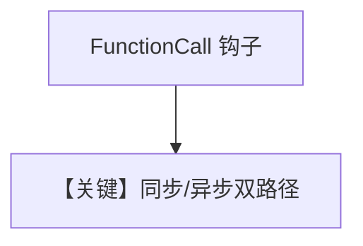

# pre_and_post_hooks.py — 实现原理分析

> 源文件：`cookbook/91_tools/tool_hooks/pre_and_post_hooks.py`

## 概述

本示例展示 **同步与异步** 两套 `@tool(pre_hook, post_hook)`：钩子接收 **`FunctionCall`**，打印名称、参数与结果；异步段使用 **`async_agent.aprint_response`**。

**核心配置一览**

| 配置项 | 值 | 说明 |
|--------|------|------|
| `dependencies` | `{"num_stories": 2}` |  |
| `tools` | `[get_top_hackernews_stories]` / `[get_top_hackernews_stories_async]` |  |
| `markdown` | `True` |  |

## Mermaid 流程图

```mermaid
flowchart TD
    A["FunctionCall 钩子"] --> B["【关键】同步/异步双路径"]
```

## 关键源码文件索引

| 文件 | 作用 |
|------|------|
| `agno/tools/function.py` | `FunctionCall` |
