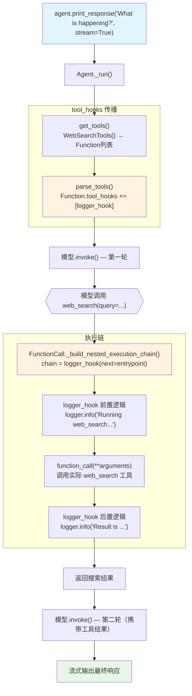

# tool_hook.py — 实现原理分析

> 源文件：`cookbook/91_tools/tool_hooks/tool_hook.py`

## 概述

本示例展示 Agno 的 **Agent 级 `tool_hooks`** 机制：在 `Agent` 构造函数中传入 `tool_hooks=[logger_hook]`，作为中间件拦截 **所有** 工具调用，在工具执行前后插入自定义逻辑（日志记录、监控、修改参数/结果等）。支持同步和异步 hook。

**核心配置一览：**

| 配置项 | 值 | 说明 |
|--------|------|------|
| `model` | `OpenAIChat(id="gpt-4o")` | Chat Completions API |
| `tools` | `[WebSearchTools()]` | 被 hook 拦截的工具 |
| `tool_hooks` | `[logger_hook]` | Agent 级工具执行中间件 |
| `instructions` | `None` | 未设置 |
| `markdown` | `None` | 未设置 |

## 架构分层

```
用户代码层                      agno.agent 层
┌─────────────────────────┐    ┌────────────────────────────────────┐
│ tool_hook.py            │    │ Agent._run()                       │
│                         │    │  ├─ get_tools()                    │
│ def logger_hook(        │    │  │   parse_tools()                 │
│   function_name: str,   │    │  │   → Function.tool_hooks=[logger]│
│   function_call: Callable│──>│  │                                 │
│   arguments: Dict       │    │  └─ FunctionCall._build_nested_    │
│ ):                      │    │      execution_chain()             │
│   # pre-hook 逻辑       │    │      → logger_hook 包裹 entrypoint │
│   result = function_call│    │      → logger_hook 中调用工具      │
│   # post-hook 逻辑      │    │      → 返回结果                    │
│   return result         │    └────────────────────────────────────┘
│                         │
│ Agent(tool_hooks=[...]) │
└─────────────────────────┘
```

## 核心组件解析

### Agent 级 tool_hooks

`Agent.tool_hooks`（`agent.py:172`）在 `parse_tools()` 阶段被传播到每个工具的 `Function.tool_hooks`：

```python
# _tools.py parse_tools() 简化
for func in tools:
    if isinstance(func, Function):
        if agent.tool_hooks:
            func.tool_hooks = (func.tool_hooks or []) + agent.tool_hooks
```

这意味着 Agent 级 `tool_hooks` 会追加到每个工具上，**对所有工具生效**。

### hook 签名与参数注入

hook 函数的参数由 `FunctionCall._build_hook_args()` 根据签名动态注入（`function.py:898`）：

```python
def logger_hook(function_name: str, function_call: Callable, arguments: Dict[str, Any]):
    # 参数注入映射：
    # function_name / name → 工具函数名
    # function_call / function / func → next_func 回调（调用以继续链）
    # arguments / args → 工具调用参数字典
    
    logger.info(f"Running {function_name} with arguments {arguments}")
    result = function_call(**arguments)   # 调用实际工具
    logger.info(f"Result of {function_name} is {result}")
    return result
```

### 嵌套执行链

`_build_nested_execution_chain()`（`function.py:928`）使用 `functools.reduce` 将 hooks 构建为嵌套调用链：

```python
# 伪代码：
# hooks = [hook_A, hook_B]
# 执行顺序：hook_A(next=hook_B(next=entrypoint))
# 即：hook_A 的 function_call 调用 → hook_B 的执行 → 最终执行工具函数
chain = reduce(create_hook_wrapper, reversed(hooks), execute_entrypoint)
```

### 异步 hook 变体

```python
async def logger_hook(
    function_name: str, function_call: Callable, arguments: Dict[str, Any]
):
    logger.info(f"Running {function_name} with arguments {arguments}")
    
    if iscoroutinefunction(function_call):
        result = await function_call(**arguments)
    else:
        result = function_call(**arguments)
    
    logger.info(f"Result of {function_name} is {result}")
    return result

agent = Agent(tools=[WebSearchTools()], tool_hooks=[logger_hook])
asyncio.run(agent.aprint_response("What is currently trending on Twitter?"))
```

异步 hook 在异步执行路径（`AsyncFunctionCall._build_nested_execution_chain_async()`）中被正确处理。同步路径中的异步 hook 会被跳过并警告。

## System Prompt 组装

| 序号 | 组成部分 | 本文件中的值/来源 | 是否生效 |
|------|---------|-----------------|---------|
| 1 | `system_message` | `None` | 否 |
| 3.1 | `instructions` | `None` | 否 |
| 3.1.1 | 模型指令 | 模型特定指令 | 是 |
| 3.2.1 | `markdown` | `None` | 否 |
| 3.3.5 | `_tool_instructions` | `None` | 否 |

### 最终 System Prompt

```text
（空或仅模型特定指令）
```

## 完整 API 请求

```python
client.chat.completions.create(
    model="gpt-4o",
    messages=[
        # system: 仅模型特定指令（如有）
        {"role": "user", "content": "What's happening in the world?"}
    ],
    tools=[
        {
            "type": "function",
            "function": {
                "name": "web_search",   # WebSearchTools 的工具名
                "description": "...",
                "parameters": {
                    "type": "object",
                    "properties": {"query": {"type": "string"}},
                    "required": ["query"]
                }
            }
        }
    ],
    stream=True,
    stream_options={"include_usage": True}
)
# 执行工具时：logger_hook 拦截 → 记录日志 → 调用 web_search → 记录结果 → 返回
```

## Mermaid 流程图



## 关键源码文件索引

| 文件 | 关键函数/类 | 作用 |
|------|------------|------|
| `agno/agent/agent.py` | `tool_hooks` L172 | Agent 级 hook 列表 |
| `agno/agent/_tools.py` | `parse_tools()` L350 | 将 Agent.tool_hooks 传播到 Function |
| `agno/tools/function.py` | `Function.tool_hooks` L168 | 函数级 hook 列表 |
| `agno/tools/function.py` | `_build_hook_args()` L898 | 根据签名动态注入 hook 参数 |
| `agno/tools/function.py` | `_build_nested_execution_chain()` L928 | 构建嵌套 hook 调用链 |
