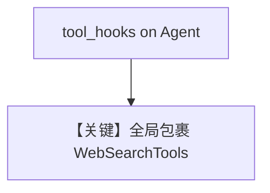

# tool_hook.py — 实现原理分析

<!-- cookbook-py-source:start -->
## 完整源码

```python
"""Show how to use a tool execution hook, to run logic before and after a tool is called."""

from typing import Any, Callable, Dict

from agno.agent import Agent
from agno.models.openai import OpenAIChat
from agno.tools.websearch import WebSearchTools
from agno.utils.log import logger

# ---------------------------------------------------------------------------
# Create Agent
# ---------------------------------------------------------------------------


def logger_hook(function_name: str, function_call: Callable, arguments: Dict[str, Any]):
    # Pre-hook logic: this runs before the tool is called
    logger.info(f"Running {function_name} with arguments {arguments}")

    # Call the tool
    result = function_call(**arguments)

    # Post-hook logic: this runs after the tool is called
    logger.info(f"Result of {function_name} is {result}")
    return result


agent = Agent(
    model=OpenAIChat(id="gpt-4o"), tools=[WebSearchTools()], tool_hooks=[logger_hook]
)

# ---------------------------------------------------------------------------
# Run Agent
# ---------------------------------------------------------------------------
if __name__ == "__main__":
    agent.print_response("What's happening in the world?", stream=True, markdown=True)

    # ---------------------------------------------------------------------------
    # Async Variant
    # ---------------------------------------------------------------------------

    """Show how to use a tool execution hook with async functions, to run logic before and after a tool is called."""

    import asyncio
    from inspect import iscoroutinefunction
    from typing import Any, Callable, Dict

    from agno.agent import Agent
    from agno.tools.websearch import WebSearchTools
    from agno.utils.log import logger

    async def logger_hook(
        function_name: str, function_call: Callable, arguments: Dict[str, Any]
    ):
        # Pre-hook logic: this runs before the tool is called
        logger.info(f"Running {function_name} with arguments {arguments}")

        # Call the tool
        if iscoroutinefunction(function_call):
            result = await function_call(**arguments)
        else:
            result = function_call(**arguments)

        # Post-hook logic: this runs after the tool is called
        logger.info(f"Result of {function_name} is {result}")
        return result

    agent = Agent(tools=[WebSearchTools()], tool_hooks=[logger_hook])

    asyncio.run(agent.aprint_response("What is currently trending on Twitter?"))
```

<!-- cookbook-py-source:end -->

> 源文件：`cookbook/91_tools/tool_hooks/tool_hook.py`

## 概述

本示例展示 **Agent 级 `tool_hooks=[logger_hook]`**：包装 **所有工具调用**（此处为 `WebSearchTools`），在前后写日志；`__main__` 第二段演示 **async `logger_hook`** 与 **`iscoroutinefunction`** 分支。

**核心配置一览（首段）**

| 配置项 | 值 | 说明 |
|--------|------|------|
| `model` | `OpenAIChat(id="gpt-4o")` |  |
| `tools` | `[WebSearchTools()]` |  |
| `tool_hooks` | `[logger_hook]` | Agent 级 |

## 运行机制与因果链

Agent 级 hook 签名 `(function_name, function_call, arguments)`，在工具真正执行前后包裹一层。

## Mermaid 流程图


```mermaid
flowchart TD
    A["tool_hooks on Agent"] --> B["【关键】全局包裹 WebSearchTools"]
```

## 关键源码文件索引

| 文件 | 作用 |
|------|------|
| `agno/agent/agent.py` | `tool_hooks` 属性 |
