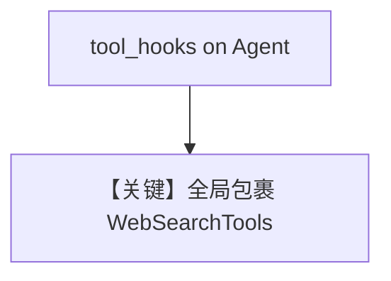

# tool_hook.py — 实现原理分析

> 源文件：`cookbook/91_tools/tool_hooks/tool_hook.py`

## 概述

本示例展示 **Agent 级 `tool_hooks=[logger_hook]`**：包装 **所有工具调用**（此处为 `WebSearchTools`），在前后写日志；`__main__` 第二段演示 **async `logger_hook`** 与 **`iscoroutinefunction`** 分支。

**核心配置一览（首段）**

| 配置项 | 值 | 说明 |
|--------|------|------|
| `model` | `OpenAIChat(id="gpt-4o")` |  |
| `tools` | `[WebSearchTools()]` |  |
| `tool_hooks` | `[logger_hook]` | Agent 级 |

## 运行机制与因果链

Agent 级 hook 签名 `(function_name, function_call, arguments)`，在工具真正执行前后包裹一层。

## Mermaid 流程图

```mermaid
flowchart TD
    A["tool_hooks on Agent"] --> B["【关键】全局包裹 WebSearchTools"]
```

## 关键源码文件索引

| 文件 | 作用 |
|------|------|
| `agno/agent/agent.py` | `tool_hooks` 属性 |
