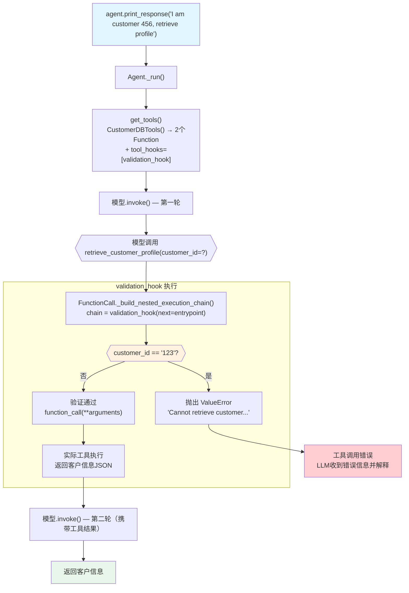

# tool_hook_in_toolkit.py — 实现原理分析

> 源文件：`cookbook/91_tools/tool_hooks/tool_hook_in_toolkit.py`

## 概述

本示例展示 **Agent 级 `tool_hooks` 与 `Toolkit` 子类组合**的机制：`validation_hook` 拦截所有工具调用，在调用前进行参数验证（如禁止对特定 ID 执行操作），验证通过后才执行工具。演示了通过抛出 `ValueError` 拒绝工具调用、以及 hook 在异步 Toolkit 场景下的 `iscoroutinefunction` 处理。

**核心配置一览：**

| 配置项 | 值 | 说明 |
|--------|------|------|
| `model` | `None` | 未显式设置 |
| `tools` | `[CustomerDBTools()]` | 自定义 Toolkit：retrieve + delete |
| `tool_hooks` | `[validation_hook]` | 参数验证中间件 |
| `validation_hook 拦截` | `customer_id == "123"` 时抛出 ValueError | 阻止危险操作 |

## 架构分层

```
用户代码层                      agno.agent 层
┌─────────────────────────┐    ┌────────────────────────────────────┐
│ tool_hook_in_toolkit.py │    │ Agent._run()                       │
│                         │    │  ├─ get_tools()                    │
│ class CustomerDBTools   │    │  │   parse_tools()                 │
│   (Toolkit):            │    │  │   → Function.tool_hooks=        │
│   def retrieve(id):...  │───>│  │     [validation_hook]           │
│   def delete(id):...    │    │  │                                  │
│                         │    │  └─ FunctionCall._build_nested_    │
│ def validation_hook(    │    │      execution_chain()             │
│   function_name, func,  │    │      → validation_hook 包裹工具   │
│   arguments):           │    │      → 验证通过才调用 func()       │
│   if bad_id: raise...   │    └────────────────────────────────────┘
│   result = func(**args) │
│   return result         │
└─────────────────────────┘
```

## 核心组件解析

### validation_hook 参数验证

```python
def validation_hook(
    function_name: str, function_call: Callable, arguments: Dict[str, Any]
):
    if function_name == "delete_customer_profile":
        cust_id = arguments.get("customer_id")
        if cust_id == "123":
            raise ValueError("Cannot delete customer profile for ID 123")
    
    if function_name == "retrieve_customer_profile":
        cust_id = arguments.get("customer_id")
        if cust_id == "123":
            raise ValueError("Cannot retrieve customer profile for ID 123")
    
    # 验证通过，调用实际工具
    result = function_call(**arguments)
    
    logger.info(
        f"Validation hook: {function_name} with arguments {arguments} returned {result}"
    )
    return result
```

hook 中抛出的 `ValueError` 会向上传播，Agent 的 `_run()` 捕获后将其作为工具执行错误，LLM 收到错误信息后可以决定如何响应（通常会向用户解释操作失败）。

### CustomerDBTools Toolkit

```python
class CustomerDBTools(Toolkit):
    def __init__(self, *args, **kwargs):
        super().__init__(*args, **kwargs)
        self.register(self.retrieve_customer_profile)
        self.register(self.delete_customer_profile)
    
    def retrieve_customer_profile(self, customer_id: str):
        """Retrieves a customer profile from the database."""
        return json.dumps({"customer_id": customer_id, "name": "John Doe", ...})
    
    def delete_customer_profile(self, customer_id: str):
        """Deletes a customer profile from the database."""
        return f"Customer profile for {customer_id}"
```

`Toolkit.register()` 将方法包装为 `Function` 对象，存入 `self.functions` 字典。`Agent(tool_hooks=[validation_hook])` 在 `parse_tools()` 时将 hook 传播到所有 Toolkit 中的 Function。

### hook 验证通过 vs 拒绝

| 场景 | hook 行为 | 最终结果 |
|------|----------|---------|
| 客户 ID=456，retrieve | 验证通过 → `function_call(**args)` | 返回客户信息 |
| 客户 ID=123，delete | 抛出 `ValueError` | 工具调用失败，LLM 收到错误 |
| 客户 ID=123，retrieve | 抛出 `ValueError` | 工具调用失败，LLM 收到错误 |

### 异步变体

```python
async def validation_hook(
    function_name: str, function_call: Callable, arguments: Dict[str, Any]
):
    if ...:
        raise ValueError(...)
    
    # 异步工具需要 await
    if iscoroutinefunction(function_call):
        result = await function_call(**arguments)
    else:
        result = function_call(**arguments)
    
    return result
```

异步 hook 中必须用 `iscoroutinefunction()` 判断 `function_call` 是否为协程，因为 Toolkit 中可能混合同步和异步方法。

## System Prompt 组装

| 序号 | 组成部分 | 本文件中的值/来源 | 是否生效 |
|------|---------|-----------------|---------|
| 1 | `system_message` | `None` | 否 |
| 3.1 | `instructions` | `None` | 否 |
| 3.1.1 | 模型指令 | 模型特定指令 | 是 |
| 3.2.1 | `markdown` | `None` | 否 |

### 最终 System Prompt

```text
（空或仅模型特定指令）
```

## 完整 API 请求

```python
client.chat.completions.create(
    model="<default-model>",
    messages=[
        {"role": "user", "content": "I am customer 456, please retrieve my profile."}
    ],
    tools=[
        {
            "type": "function",
            "function": {
                "name": "retrieve_customer_profile",
                "description": "Retrieves a customer profile from the database.",
                "parameters": {
                    "type": "object",
                    "properties": {
                        "customer_id": {"type": "string", "description": "The ID of the customer to retrieve."}
                    },
                    "required": ["customer_id"]
                }
            }
        },
        {
            "type": "function",
            "function": {
                "name": "delete_customer_profile",
                "description": "Deletes a customer profile from the database.",
                "parameters": {
                    "type": "object",
                    "properties": {
                        "customer_id": {"type": "string"}
                    },
                    "required": ["customer_id"]
                }
            }
        }
    ]
)
# customer_id=456: validation_hook 验证通过 → 正常执行
# customer_id=123: validation_hook 抛出 ValueError → 工具失败 → LLM 收到错误
```

## Mermaid 流程图



## 关键源码文件索引

| 文件 | 关键函数/类 | 作用 |
|------|------------|------|
| `agno/tools/toolkit.py` | `Toolkit.register()` | 注册方法为 Function |
| `agno/agent/agent.py` | `tool_hooks` L172 | Agent 级 hook 列表 |
| `agno/agent/_tools.py` | `parse_tools()` L350 | 将 tool_hooks 传播到所有 Function |
| `agno/tools/function.py` | `_build_hook_args()` L898 | 动态注入 hook 参数 |
| `agno/tools/function.py` | `_build_nested_execution_chain()` L928 | 构建嵌套调用链 |
