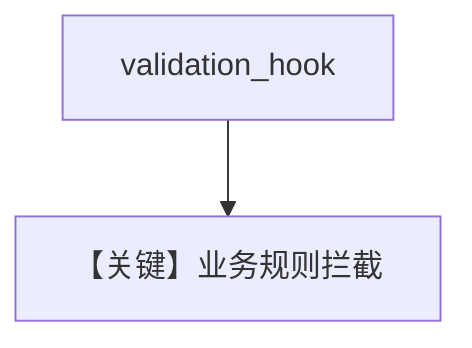

# tool_hook_in_toolkit.py — 实现原理分析

<!-- cookbook-py-source:start -->
## 完整源码

```python
"""Show how to use a tool execution hook, to run logic before and after a tool is called."""

import json
from typing import Any, Callable, Dict

from agno.agent import Agent
from agno.tools import Toolkit
from agno.utils.log import logger

# ---------------------------------------------------------------------------
# Create Agent
# ---------------------------------------------------------------------------


class CustomerDBTools(Toolkit):
    def __init__(self, *args, **kwargs):
        super().__init__(*args, **kwargs)

        self.register(self.retrieve_customer_profile)
        self.register(self.delete_customer_profile)

    def retrieve_customer_profile(self, customer_id: str):
        """
        Retrieves a customer profile from the database.

        Args:
            customer_id: The ID of the customer to retrieve.

        Returns:
            A string containing the customer profile.
        """
        logger.info(f"Looking up customer profile for {customer_id}")
        return json.dumps(
            {
                "customer_id": customer_id,
                "name": "John Doe",
                "email": "john.doe@example.com",
            }
        )

    def delete_customer_profile(self, customer_id: str):
        """
        Deletes a customer profile from the database.

        Args:
            customer_id: The ID of the customer to delete.
        """
        logger.info(f"Deleting customer profile for {customer_id}")
        return f"Customer profile for {customer_id}"


def validation_hook(
    function_name: str, function_call: Callable, arguments: Dict[str, Any]
):
    if function_name == "delete_customer_profile":
        cust_id = arguments.get("customer_id")
        if cust_id == "123":
            raise ValueError("Cannot delete customer profile for ID 123")

    if function_name == "retrieve_customer_profile":
        cust_id = arguments.get("customer_id")
        if cust_id == "123":
            raise ValueError("Cannot retrieve customer profile for ID 123")

    result = function_call(**arguments)

    logger.info(
        f"Validation hook: {function_name} with arguments {arguments} returned {result}"
    )

    return result


agent = Agent(tools=[CustomerDBTools()], tool_hooks=[validation_hook])

# This should work

# ---------------------------------------------------------------------------
# Run Agent
# ---------------------------------------------------------------------------
if __name__ == "__main__":
    agent.print_response("I am customer 456, please retrieve my profile.")

    # This should fail
    agent.print_response("I am customer 123, please delete my profile.")

    # ---------------------------------------------------------------------------
    # Async Variant
    # ---------------------------------------------------------------------------

    """Show how to use a tool execution hook with async functions, to run logic before and after a tool is called."""

    import asyncio
    import json
    from inspect import iscoroutinefunction
    from typing import Any, Callable, Dict

    from agno.agent import Agent
    from agno.tools import Toolkit
    from agno.utils.log import logger

    class CustomerDBTools(Toolkit):
        def __init__(self, *args, **kwargs):
            super().__init__(*args, **kwargs)

            self.register(self.retrieve_customer_profile)
            self.register(self.delete_customer_profile)

        async def retrieve_customer_profile(self, customer_id: str):
            """
            Retrieves a customer profile from the database.

            Args:
                customer_id: The ID of the customer to retrieve.

            Returns:
                A string containing the customer profile.
            """
            logger.info(f"Looking up customer profile for {customer_id}")
            return json.dumps(
                {
                    "customer_id": customer_id,
                    "name": "John Doe",
                    "email": "john.doe@example.com",
                }
            )

        def delete_customer_profile(self, customer_id: str):
            """
            Deletes a customer profile from the database.

            Args:
                customer_id: The ID of the customer to delete.
            """
            logger.info(f"Deleting customer profile for {customer_id}")
            return f"Customer profile for {customer_id}"

    async def validation_hook(
        function_name: str, function_call: Callable, arguments: Dict[str, Any]
    ):
        if function_name == "delete_customer_profile":
            cust_id = arguments.get("customer_id")
            if cust_id == "123":
                raise ValueError("Cannot delete customer profile for ID 123")

        if function_name == "retrieve_customer_profile":
            cust_id = arguments.get("customer_id")
            if cust_id == "123":
                raise ValueError("Cannot retrieve customer profile for ID 123")

        if iscoroutinefunction(function_call):
            result = await function_call(**arguments)
        else:
            result = function_call(**arguments)

        logger.info(
            f"Validation hook: {function_name} with arguments {arguments} returned {result}"
        )

        return result

    agent = Agent(tools=[CustomerDBTools()], tool_hooks=[validation_hook])

    asyncio.run(agent.aprint_response("I am customer 456, please retrieve my profile."))
    asyncio.run(agent.aprint_response("I am customer 456, please delete my profile."))
```

<!-- cookbook-py-source:end -->

> 源文件：`cookbook/91_tools/tool_hooks/tool_hook_in_toolkit.py`

## 概述

本示例展示 **`CustomerDBTools` Toolkit** 与 **`validation_hook`**：在调用前拦截 `customer_id == "123"` 的删除/查询并 **`raise ValueError`**；后半段为异步 Toolkit + 异步 hook。

**核心配置一览**

| 配置项 | 值 | 说明 |
|--------|------|------|
| `tools` | `[CustomerDBTools()]` |  |
| `tool_hooks` | `[validation_hook]` |  |

## Mermaid 流程图


```mermaid
flowchart TD
    A["validation_hook"] --> B["【关键】业务规则拦截"]
```

## 关键源码文件索引

| 文件 | 作用 |
|------|------|
| `agno/tools/toolkit.py` | `Toolkit.register` |
