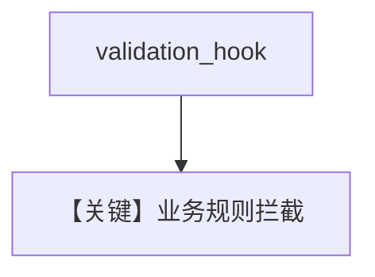

# tool_hook_in_toolkit.py — 实现原理分析

> 源文件：`cookbook/91_tools/tool_hooks/tool_hook_in_toolkit.py`

## 概述

本示例展示 **`CustomerDBTools` Toolkit** 与 **`validation_hook`**：在调用前拦截 `customer_id == "123"` 的删除/查询并 **`raise ValueError`**；后半段为异步 Toolkit + 异步 hook。

**核心配置一览**

| 配置项 | 值 | 说明 |
|--------|------|------|
| `tools` | `[CustomerDBTools()]` |  |
| `tool_hooks` | `[validation_hook]` |  |

## Mermaid 流程图

```mermaid
flowchart TD
    A["validation_hook"] --> B["【关键】业务规则拦截"]
```

## 关键源码文件索引

| 文件 | 作用 |
|------|------|
| `agno/tools/toolkit.py` | `Toolkit.register` |
