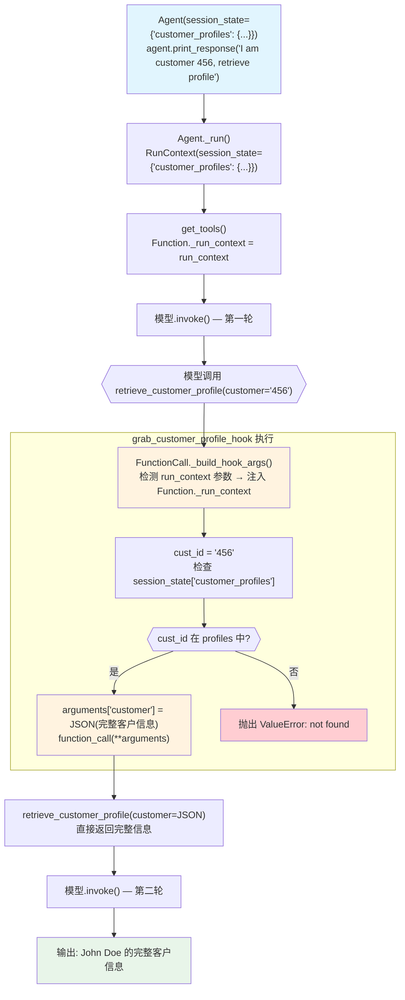

# tool_hook_in_toolkit_with_state.py — 实现原理分析

> 源文件：`cookbook/91_tools/tool_hooks/tool_hook_in_toolkit_with_state.py`

## 概述

本示例展示 **`tool_hooks` 通过 `run_context: RunContext` 访问 `session_state`** 的机制：hook 从 `session_state["customer_profiles"]` 中查找完整客户信息，将参数（客户 ID）替换为实际数据后再调用工具，实现了工具调用参数的动态增强（data enrichment）。

**核心配置一览：**

| 配置项 | 值 | 说明 |
|--------|------|------|
| `model` | `None` | 未显式设置 |
| `tools` | `[CustomerDBTools()]` | 自定义 Toolkit |
| `tool_hooks` | `[grab_customer_profile_hook]` | 参数增强 hook |
| `session_state` | `{"customer_profiles": {"123": {...}, "456": {...}}}` | 初始状态，含客户数据 |
| hook 签名 `run_context: RunContext` | `run_context.session_state` | 框架自动注入 RunContext |

## 架构分层

```
用户代码层                      agno.agent 层
┌─────────────────────────┐    ┌────────────────────────────────────┐
│ tool_hook_in_toolkit_   │    │ Agent._run()                       │
│ with_state.py           │    │  ├─ RunContext(session_state=...)   │
│                         │    │  │   绑定到 Function._run_context   │
│ def grab_customer_      │    │  │                                  │
│ profile_hook(           │───>│  └─ FunctionCall._build_hook_args  │
│   run_context:RunContext│    │      → 检测 "run_context" 参数     │
│   function_call,        │    │      → 注入 Function._run_context  │
│   arguments,            │    │                                    │
│ ):                      │    └────────────────────────────────────┘
│   cust_id = args[...]   │
│   profile = run_context │
│     .session_state[...] │
│   arguments["customer"] │
│     = json.dumps(profile)│
│   return func(**args)   │
└─────────────────────────┘
```

## 核心组件解析

### RunContext 注入到 hook

`_build_hook_args()` 在 `function.py:898` 检查 hook 签名中的 `run_context` 参数：

```python
# function.py:910-911
if "run_context" in signature(hook).parameters:
    hook_args["run_context"] = self.function._run_context
```

`Function._run_context` 在 `parse_tools()` 阶段由 Agent 绑定（每次 `_run()` 调用时更新），因此 hook 总能获取到当前运行的 `RunContext`，包含最新的 `session_state`。

### 参数动态替换（数据增强）

```python
def grab_customer_profile_hook(
    run_context: RunContext,      # 框架注入
    function_call: Callable,      # next_func 回调
    arguments: Dict[str, Any],    # 工具参数（可修改！）
):
    cust_id = arguments.get("customer")
    
    if cust_id not in run_context.session_state["customer_profiles"]:
        raise ValueError(f"Customer profile for {cust_id} not found")
    
    # 从 session_state 获取完整客户信息
    customer_profile = run_context.session_state["customer_profiles"][cust_id]
    
    # 替换参数：将 ID 替换为完整的客户信息 JSON
    arguments["customer"] = json.dumps(customer_profile)
    
    # 调用实际工具（传入增强后的参数）
    result = function_call(**arguments)
    return result
```

工具函数接收到的不再是 ID 字符串，而是完整的客户信息 JSON，实现了对工具参数的透明增强。

### session_state 初始化

```python
agent = Agent(
    tools=[CustomerDBTools()],
    tool_hooks=[grab_customer_profile_hook],
    session_state={
        "customer_profiles": {
            "123": {"name": "Jane Doe", "email": "jane.doe@example.com"},
            "456": {"name": "John Doe", "email": "john.doe@example.com"},
        }
    },
)
```

`session_state` 中存储的是"数据库"，hook 充当了数据层，工具函数本身保持简单（直接返回传入的参数）。

### CustomerDBTools（简化版）

```python
class CustomerDBTools(Toolkit):
    def retrieve_customer_profile(self, customer: str):
        """Retrieves a customer profile from the database."""
        return customer   # 直接返回（hook 已预先填充完整数据）
```

工具本身极简，数据查找逻辑全部在 hook 中完成。

## System Prompt 组装

| 序号 | 组成部分 | 本文件中的值/来源 | 是否生效 |
|------|---------|-----------------|---------|
| 1 | `system_message` | `None` | 否 |
| 3.1 | `instructions` | `None` | 否 |
| 3.2.1 | `markdown` | `None` | 否 |
| 3.3.17 | `add_session_state_to_context` | `False`（默认） | 否 |

### 最终 System Prompt

```text
（空或仅模型特定指令）
```

## 完整 API 请求

```python
client.chat.completions.create(
    model="<default-model>",
    messages=[
        {"role": "user", "content": "I am customer 456, please retrieve my profile."}
    ],
    tools=[
        {
            "type": "function",
            "function": {
                "name": "retrieve_customer_profile",
                "description": "Retrieves a customer profile from the database.",
                "parameters": {
                    "type": "object",
                    "properties": {
                        "customer": {"type": "string", "description": "The ID of the customer to retrieve."}
                    },
                    "required": ["customer"]
                }
            }
        }
    ]
)
# 工具执行：
# LLM 传入 arguments={"customer": "456"}
# hook 从 session_state["customer_profiles"]["456"] 获取完整信息
# hook 替换 arguments["customer"] = '{"name": "John Doe", "email": "..."}' 
# 工具函数接收完整 JSON 并直接返回
```

## Mermaid 流程图



## 关键源码文件索引

| 文件 | 关键函数/类 | 作用 |
|------|------------|------|
| `agno/run/base.py` | `RunContext` L16 | 运行上下文（含 session_state） |
| `agno/tools/function.py` | `Function._run_context` L201 | 绑定当前运行的 RunContext |
| `agno/tools/function.py` | `_build_hook_args()` L898 | 检测并注入 run_context |
| `agno/agent/agent.py` | `session_state` L84 | 默认会话状态 |
| `agno/agent/_tools.py` | `parse_tools()` L350 | 将 tool_hooks 传播到 Function |
