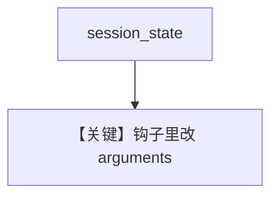

# tool_hook_in_toolkit_with_state.py — 实现原理分析

> 源文件：`cookbook/91_tools/tool_hooks/tool_hook_in_toolkit_with_state.py`

## 概述

本示例展示 **`grab_customer_profile_hook(run_context, function_call, arguments)`**（无 `function_name` 参数的重载形式）：从 **`session_state["customer_profiles"]`** 查表，把 `arguments["customer"]` 替换为完整 JSON 再调用工具。

**核心配置一览**

| 配置项 | 值 | 说明 |
|--------|------|------|
| `tools` | `[CustomerDBTools()]` |  |
| `tool_hooks` | `[grab_customer_profile_hook]` |  |
| `session_state` | `{"customer_profiles": {...}}` |  |

## Mermaid 流程图

```mermaid
flowchart TD
    A["session_state"] --> B["【关键】钩子里改 arguments"]
```

## 关键源码文件索引

| 文件 | 作用 |
|------|------|
| `agno/run/base.py` | `RunContext` |
