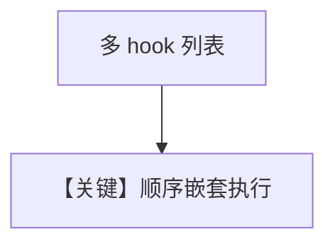

# tool_hook_in_toolkit_with_state_nested.py — 实现原理分析

> 源文件：`cookbook/91_tools/tool_hooks/tool_hook_in_toolkit_with_state_nested.py`

## 概述

本示例在 `tool_hook_in_toolkit_with_state` 基础上增加 **`logger_hook(name, func, arguments)`** 形态，**两个 hook 串联**：先查 session 并改写参数，再记日志。

**核心配置一览**

| 配置项 | 值 | 说明 |
|--------|------|------|
| `tool_hooks` | `[grab_customer_profile_hook, logger_hook]` | 顺序执行 |

## Mermaid 流程图

## 关键源码文件索引

| 文件 | 作用 |
|------|------|
| `agno/agent/` | hook 链调用 |
