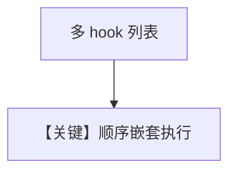

# tool_hook_in_toolkit_with_state_nested.py — 实现原理分析

<!-- cookbook-py-source:start -->
## 完整源码

```python
"""Show how to use a tool execution hook, to run logic before and after a tool is called."""

import json
from typing import Any, Callable, Dict

from agno.agent import Agent
from agno.run import RunContext
from agno.tools import Toolkit
from agno.utils.log import logger

# ---------------------------------------------------------------------------
# Create Agent
# ---------------------------------------------------------------------------


class CustomerDBTools(Toolkit):
    def __init__(self, *args, **kwargs):
        super().__init__(*args, **kwargs)

        self.register(self.retrieve_customer_profile)

    def retrieve_customer_profile(self, customer: str):
        """
        Retrieves a customer profile from the database.

        Args:
            customer: The ID of the customer to retrieve.

        Returns:
            A string containing the customer profile.
        """
        return customer


# When used as a tool hook, this function will receive the contextual Agent, function_name, etc as parameters
def grab_customer_profile_hook(
    run_context: RunContext,
    function_name: str,
    function_call: Callable,
    arguments: Dict[str, Any],
):
    if run_context.session_state is None:
        run_context.session_state = {}

    session_state = run_context.session_state
    cust_id = arguments.get("customer")
    if cust_id not in session_state["customer_profiles"]:  # type: ignore
        raise ValueError(f"Customer profile for {cust_id} not found")
    customer_profile = session_state["customer_profiles"][cust_id]  # type: ignore

    # Replace the customer with the customer_profile
    arguments["customer"] = json.dumps(customer_profile)
    # Call the function with the updated arguments
    result = function_call(**arguments)

    return result


def logger_hook(name: str, func: Callable, arguments: Dict[str, Any]):
    logger.info("Before Logger Hook")
    result = func(**arguments)
    logger.info("After Logger Hook")
    return result


agent = Agent(
    tools=[CustomerDBTools()],
    tool_hooks=[grab_customer_profile_hook, logger_hook],
    session_state={
        "customer_profiles": {
            "123": {"name": "Jane Doe", "email": "jane.doe@example.com"},
            "456": {"name": "John Doe", "email": "john.doe@example.com"},
        }
    },
)

# This should work

# ---------------------------------------------------------------------------
# Run Agent
# ---------------------------------------------------------------------------
if __name__ == "__main__":
    agent.print_response("I am customer 456, please retrieve my profile.")

    # This should fail
    # agent.print_response("I am customer 789, please retrieve my profile.")
```

<!-- cookbook-py-source:end -->

> 源文件：`cookbook/91_tools/tool_hooks/tool_hook_in_toolkit_with_state_nested.py`

## 概述

本示例在 `tool_hook_in_toolkit_with_state` 基础上增加 **`logger_hook(name, func, arguments)`** 形态，**两个 hook 串联**：先查 session 并改写参数，再记日志。

**核心配置一览**

| 配置项 | 值 | 说明 |
|--------|------|------|
| `tool_hooks` | `[grab_customer_profile_hook, logger_hook]` | 顺序执行 |

## Mermaid 流程图



## 关键源码文件索引

| 文件 | 作用 |
|------|------|
| `agno/agent/` | hook 链调用 |
