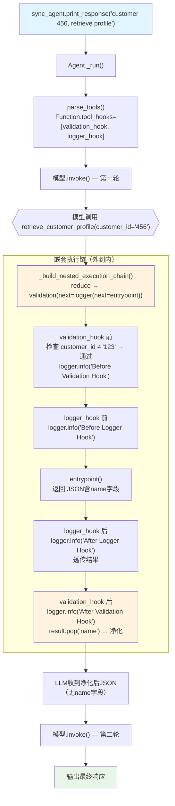

# tool_hooks_in_toolkit_nested.py — 实现原理分析

> 源文件：`cookbook/91_tools/tool_hooks/tool_hooks_in_toolkit_nested.py`

## 概述

本示例展示 **多个 `tool_hooks` 的嵌套链式执行**机制：`tool_hooks=[validation_hook, logger_hook]` 中的 hook 按顺序形成嵌套调用链（`validation_hook` 包裹 `logger_hook` 包裹 `entrypoint`），每个 hook 都可以修改参数和结果，并可选择是否继续调用链。演示了多 hook 协作实现参数验证 + 结果净化 + 日志记录。

**核心配置一览：**

| 配置项 | 值 | 说明 |
|--------|------|------|
| `model` | `None` | 未显式设置 |
| `tools` | `[CustomerDBTools()]` | retrieve + delete 两个工具 |
| `tool_hooks` | `[validation_hook, logger_hook]` | 按顺序嵌套：验证在外，日志在内 |
| `validation_hook` | 验证 ID=123 并净化结果（移除 name 字段） | 先执行 |
| `logger_hook` | 记录执行前后日志 | 后执行（在 validation_hook 内部） |

## 架构分层

```
用户代码层                        agno.agent 层
┌───────────────────────────┐    ┌──────────────────────────────────────────┐
│ tool_hooks_in_toolkit_    │    │ FunctionCall._build_nested_execution_    │
│ nested.py                 │    │ chain()                                  │
│                           │    │                                          │
│ tool_hooks=[              │    │ hooks = [validation_hook, logger_hook]   │
│   validation_hook,        │───>│                                          │
│   logger_hook             │    │ chain = reduce(create_hook_wrapper,      │
│ ]                         │    │   reversed(hooks),   # [logger, valid]   │
│                           │    │   execute_entrypoint)                    │
│ # 执行顺序：              │    │                                          │
│ # validation_hook         │    │ # 结果：                                 │
│ #   → logger_hook         │    │ # validation_hook(                       │
│ #     → entrypoint        │    │ #   next=logger_hook(                    │
│ #   ← logger_hook         │    │ #     next=entrypoint))                  │
│ # ← validation_hook       │    └──────────────────────────────────────────┘
└───────────────────────────┘
```

## 核心组件解析

### 嵌套链构建（reduce 算法）

```python
# function.py:928 _build_nested_execution_chain() 简化
def _build_nested_execution_chain(self, entrypoint_args):
    def execute_entrypoint(name, func, args):
        return self.function.entrypoint(**entrypoint_args_with_args)
    
    def create_hook_wrapper(inner_func, hook):
        def wrapper(name, func, args):
            def next_func(**kwargs):
                return inner_func(name, func, kwargs)   # 调用内层函数
            
            hook_args = self._build_hook_args(hook, name, next_func, args)
            return hook(**hook_args)
        return wrapper
    
    # reversed([validation, logger]) = [logger, validation]
    # reduce 从左到右：
    #   第一步：create_hook_wrapper(execute_entrypoint, logger) → logger_wrapper
    #   第二步：create_hook_wrapper(logger_wrapper, validation) → validation_wrapper
    # 最终 chain = validation_wrapper（最外层）
    hooks = list(reversed(self.function.tool_hooks))
    chain = reduce(create_hook_wrapper, hooks, execute_entrypoint)
    return chain
```

执行顺序（外到内）：`validation_hook` → `logger_hook` → `entrypoint` → `logger_hook（后）` → `validation_hook（后）`

### validation_hook（外层）

```python
def validation_hook(name: str, func: Callable, arguments: Dict[str, Any]):
    # 1. 前置验证
    if name == "retrieve_customer_profile":
        if arguments.get("customer_id") == "123":
            raise ValueError("Cannot retrieve customer profile for ID 123")
    
    logger.info("Before Validation Hook")
    result = func(**arguments)   # 调用内层链（logger_hook → entrypoint）
    logger.info("After Validation Hook")
    
    # 2. 后置结果净化（移除 name 字段）
    result = json.loads(result)
    result.pop("name")
    return json.dumps(result)   # 返回净化后的结果
```

### logger_hook（内层）

```python
def logger_hook(name: str, func: Callable, arguments: Dict[str, Any]):
    logger.info("Before Logger Hook")
    result = func(**arguments)   # 调用最内层（entrypoint）
    logger.info("After Logger Hook")
    return result   # 不修改结果，直接透传
```

### 完整执行日志

```
INFO: Before Validation Hook    # validation_hook 前
INFO: Before Logger Hook        # logger_hook 前  
INFO: Looking up customer...    # entrypoint 执行
INFO: After Logger Hook         # logger_hook 后
INFO: After Validation Hook     # validation_hook 后（此时已净化 name 字段）
```

### 异步变体的 iscoroutinefunction 处理

```python
async def validation_hook_async(name: str, func: Callable, arguments: Dict[str, Any]):
    ...
    if iscoroutinefunction(func):
        result = await func(**arguments)   # 异步调用内层
    else:
        result = func(**arguments)
    
    # 对 retrieve_customer_profile 净化结果
    if name == "retrieve_customer_profile":
        result = json.loads(result)
        result.pop("name")
        return json.dumps(result)
    return result
```

在异步链中，每个 hook 的 `func`（next_func）也是 async 的，需用 `await` 调用。

## System Prompt 组装

| 序号 | 组成部分 | 本文件中的值/来源 | 是否生效 |
|------|---------|-----------------|---------|
| 1 | `system_message` | `None` | 否 |
| 3.1 | `instructions` | `None` | 否 |
| 3.2.1 | `markdown` | `None` | 否 |

### 最终 System Prompt

```text
（空或仅模型特定指令）
```

## 完整 API 请求

```python
client.chat.completions.create(
    model="<default-model>",
    messages=[
        {"role": "user", "content": "I am customer 456, please retrieve my profile."}
    ],
    tools=[
        {"type": "function", "function": {"name": "retrieve_customer_profile", ...}},
        {"type": "function", "function": {"name": "delete_customer_profile", ...}}
    ]
)
# 工具执行链（customer_id=456）：
# 1. validation_hook: 验证通过（非123），调用 next_func
# 2. logger_hook: 记录 "Before Logger Hook"，调用 entrypoint
# 3. entrypoint: 返回 {"customer_id":"456","name":"John Doe","email":"..."}
# 4. logger_hook: 记录 "After Logger Hook"，返回原始结果
# 5. validation_hook: 记录 "After Validation Hook"，移除 name 字段，返回净化结果
# 最终 LLM 收到的工具结果: {"customer_id":"456","email":"john.doe@example.com"}
```

## Mermaid 流程图



## 关键源码文件索引

| 文件 | 关键函数/类 | 作用 |
|------|------------|------|
| `agno/tools/function.py` | `_build_nested_execution_chain()` L928 | reduce 构建嵌套 hook 链 |
| `agno/tools/function.py` | `_build_hook_args()` L898 | 注入 name/func/arguments 到 hook |
| `agno/tools/function.py` | `Function.tool_hooks` L168 | hook 列表（保持顺序） |
| `agno/agent/_tools.py` | `parse_tools()` L350 | 传播 Agent.tool_hooks 到 Function |
| `agno/tools/toolkit.py` | `Toolkit.register()` | 注册方法为 Function |
