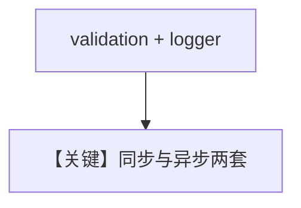

# tool_hooks_in_toolkit_nested.py — 实现原理分析

<!-- cookbook-py-source:start -->
## 完整源码

```python
"""Show how to use multiple tool execution hooks, to run logic before and after a tool is called."""

import asyncio
import json
from inspect import iscoroutinefunction
from typing import Any, Callable, Dict

from agno.agent import Agent
from agno.tools import Toolkit
from agno.utils.log import logger

# ---------------------------------------------------------------------------
# Create Agent
# ---------------------------------------------------------------------------


class CustomerDBTools(Toolkit):
    def __init__(self, *args, **kwargs):
        super().__init__(*args, **kwargs)

        self.register(self.retrieve_customer_profile)
        self.register(self.delete_customer_profile)

    def retrieve_customer_profile(self, customer_id: str):
        """
        Retrieves a customer profile from the database.

        Args:
            customer_id: The ID of the customer to retrieve.

        Returns:
            A string containing the customer profile.
        """
        logger.info(f"Looking up customer profile for {customer_id}")
        return json.dumps(
            {
                "customer_id": customer_id,
                "name": "John Doe",
                "email": "john.doe@example.com",
            }
        )

    def delete_customer_profile(self, customer_id: str):
        """
        Deletes a customer profile from the database.

        Args:
            customer_id: The ID of the customer to delete.
        """
        logger.info(f"Deleting customer profile for {customer_id}")
        return f"Customer profile for {customer_id}"


def validation_hook(name: str, func: Callable, arguments: Dict[str, Any]):
    if name == "retrieve_customer_profile":
        cust_id = arguments.get("customer_id")
        if cust_id == "123":
            raise ValueError("Cannot retrieve customer profile for ID 123")

    if name == "delete_customer_profile":
        cust_id = arguments.get("customer_id")
        if cust_id == "123":
            raise ValueError("Cannot delete customer profile for ID 123")

    logger.info("Before Validation Hook")
    result = func(**arguments)
    logger.info("After Validation Hook")
    # Remove name from result to sanitize the output
    result = json.loads(result)
    result.pop("name")
    return json.dumps(result)


def logger_hook(name: str, func: Callable, arguments: Dict[str, Any]):
    logger.info("Before Logger Hook")
    result = func(**arguments)
    logger.info("After Logger Hook")
    return result


sync_agent = Agent(
    tools=[CustomerDBTools()],
    # Hooks are executed in order of the list
    tool_hooks=[validation_hook, logger_hook],
)


# ---------------------------------------------------------------------------
# Async Variant
# ---------------------------------------------------------------------------


class CustomerDBToolsAsync(Toolkit):
    def __init__(self, *args, **kwargs):
        super().__init__(*args, **kwargs)

        self.register(self.retrieve_customer_profile)
        self.register(self.delete_customer_profile)

    async def retrieve_customer_profile(self, customer_id: str):
        """
        Retrieves a customer profile from the database.

        Args:
            customer_id: The ID of the customer to retrieve.

        Returns:
            A string containing the customer profile.
        """
        logger.info(f"Looking up customer profile for {customer_id}")
        return json.dumps(
            {
                "customer_id": customer_id,
                "name": "John Doe",
                "email": "john.doe@example.com",
            }
        )

    def delete_customer_profile(self, customer_id: str):
        """
        Deletes a customer profile from the database.

        Args:
            customer_id: The ID of the customer to delete.
        """
        logger.info(f"Deleting customer profile for {customer_id}")
        return f"Customer profile for {customer_id}"


async def validation_hook_async(name: str, func: Callable, arguments: Dict[str, Any]):
    if name == "retrieve_customer_profile":
        cust_id = arguments.get("customer_id")
        if cust_id == "123":
            raise ValueError("Cannot retrieve customer profile for ID 123")

    if name == "delete_customer_profile":
        cust_id = arguments.get("customer_id")
        if cust_id == "123":
            raise ValueError("Cannot delete customer profile for ID 123")

    logger.info("Before Validation Hook")
    if iscoroutinefunction(func):
        result = await func(**arguments)
    else:
        result = func(**arguments)
    logger.info("After Validation Hook")
    # Remove name from result to sanitize the output
    if name == "retrieve_customer_profile":
        result = json.loads(result)
        result.pop("name")
        return json.dumps(result)
    return result


async def logger_hook_async(name: str, func: Callable, arguments: Dict[str, Any]):
    logger.info("Before Logger Hook")
    if iscoroutinefunction(func):
        result = await func(**arguments)
    else:
        result = func(**arguments)
    logger.info("After Logger Hook")
    return result


async_agent = Agent(
    tools=[CustomerDBToolsAsync()],
    # Hooks are executed in order of the list
    tool_hooks=[validation_hook_async, logger_hook_async],
)


# ---------------------------------------------------------------------------
# Run Agent
# ---------------------------------------------------------------------------

if __name__ == "__main__":
    sync_agent.print_response("I am customer 456, please retrieve my profile.")
    asyncio.run(
        async_agent.aprint_response(
            "I am customer 456, please retrieve my profile.", stream=True
        )
    )
    asyncio.run(
        async_agent.aprint_response(
            "I am customer 456, please delete my profile.", stream=True
        )
    )
```

<!-- cookbook-py-source:end -->

> 源文件：`cookbook/91_tools/tool_hooks/tool_hooks_in_toolkit_nested.py`

## 概述

本示例展示 **两个 Agent 级 hook**：`validation_hook`（业务校验 + 结果裁剪）与 `logger_hook`；并提供 **`CustomerDBToolsAsync`** + **`validation_hook_async`/`logger_hook_async`** 的异步组合。

**核心配置一览（`sync_agent`）**

| 配置项 | 值 | 说明 |
|--------|------|------|
| `tools` | `[CustomerDBTools()]` |  |
| `tool_hooks` | `[validation_hook, logger_hook]` | 注释：按列表顺序 |

## Mermaid 流程图


```mermaid
flowchart TD
    A["validation + logger"] --> B["【关键】同步与异步两套"]
```

## 关键源码文件索引

| 文件 | 作用 |
|------|------|
| `agno/agent/` | 异步工具与 hook |
