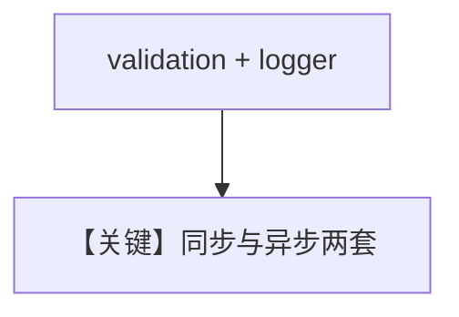

# tool_hooks_in_toolkit_nested.py — 实现原理分析

> 源文件：`cookbook/91_tools/tool_hooks/tool_hooks_in_toolkit_nested.py`

## 概述

本示例展示 **两个 Agent 级 hook**：`validation_hook`（业务校验 + 结果裁剪）与 `logger_hook`；并提供 **`CustomerDBToolsAsync`** + **`validation_hook_async`/`logger_hook_async`** 的异步组合。

**核心配置一览（`sync_agent`）**

| 配置项 | 值 | 说明 |
|--------|------|------|
| `tools` | `[CustomerDBTools()]` |  |
| `tool_hooks` | `[validation_hook, logger_hook]` | 注释：按列表顺序 |

## Mermaid 流程图

```mermaid
flowchart TD
    A["validation + logger"] --> B["【关键】同步与异步两套"]
```

## 关键源码文件索引

| 文件 | 作用 |
|------|------|
| `agno/agent/` | 异步工具与 hook |
