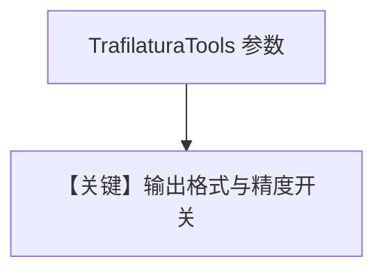

# trafilatura_tools.py — 实现原理分析

> 源文件：`cookbook/91_tools/trafilatura_tools.py`

## 概述

本文件为 **大型多示例脚本**：通过多个函数（`basic_text_extraction`、`json_with_metadata`、`research_assistant_agent` 等）演示 **`TrafilaturaTools`** 的 **输出格式**（txt/json/markdown/xml）、**元数据**、**精度/召回**、**语言**、**爬站条数** 等。`__main__` 默认仅调用 **`basic_text_extraction()`**。

**核心配置一览（默认执行路径 `basic_text_extraction` 内 Agent）**

| 配置项 | 值 | 说明 |
|--------|------|------|
| `tools` | `[TrafilaturaTools()]` | 默认配置 |
| `markdown` | `True` |  |

`research_assistant_agent` 等示例使用 `OpenAIChat(id="gpt-4")` 与长 `instructions`，需单独取消注释运行。

## 运行机制与因果链

1. **数据路径**：用户 URL/任务 → 模型调用 trafilatura 封装函数 → 净文本/结构化结果 → 总结。
2. **副作用**：出站 HTTP；无 Agent `db`（除非读者自行扩展）。
3. **与相邻示例差异**：同目录其它工具多「单一 Agent」，本文件强调 **参数矩阵** 与 **函数式组织**。

## System Prompt 组装

多数内部 Agent 仅有 markdown 段 + 工具说明；带长 `instructions` 的示例以源码字面量为准（如 `research_assistant_agent` 内多行字符串）。

## Mermaid 流程图

## 关键源码文件索引

| 文件 | 作用 |
|------|------|
| `agno/tools/trafilatura/` | `TrafilaturaTools` |
