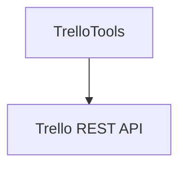

# trello_tools.py — 实现原理分析

> 源文件：`cookbook/91_tools/trello_tools.py`

## 概述

本示例展示 **`TrelloTools()`** 与 **多行 `instructions`**（看板/列表/卡片操作与错误处理），文件头为 Trello API 申请步骤。

**核心配置一览**

| 配置项 | 值 | 说明 |
|--------|------|------|
| `instructions` | 多条 | Trello 助手行为 |
| `tools` | `[TrelloTools()]` |  |

## Mermaid 流程图

## 关键源码文件索引

| 文件 | 作用 |
|------|------|
| `agno/tools/trello/` | `TrelloTools` |
