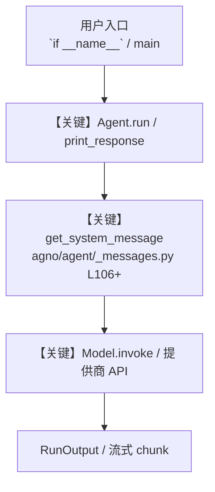

# visualization_tools.py — 实现原理分析

<!-- cookbook-py-source:start -->
## 完整源码

```python
"""Data Visualization Tools - Create Charts and Graphs with AI Agents

This example shows how to use the VisualizationTools to create various types of charts
and graphs for data visualization. Demonstrates include_tools/exclude_tools patterns
for selective visualization function access.

Run: `uv pip install matplotlib` to install the dependencies
"""

from agno.agent import Agent
from agno.models.openai import OpenAIChat
from agno.tools.visualization import VisualizationTools

# ---------------------------------------------------------------------------
# Create Agent
# ---------------------------------------------------------------------------


# Example 1: Enable all visualization functions
viz_agent_all = Agent(
    model=OpenAIChat(id="gpt-4o"),
    tools=[
        VisualizationTools(
            all=True,  # Enable all visualization functions
            output_dir="business_charts",
        )
    ],
    instructions=[
        "You are a data visualization expert with access to all chart types.",
        "Use appropriate visualization functions for the data presented.",
        "Always provide meaningful titles, axis labels, and context.",
        "Suggest insights based on the data visualized.",
        "Format data appropriately for each chart type.",
    ],
    markdown=True,
)

# Example 1b: All visualization functions available (explicit flags)
viz_agent_full = Agent(
    model=OpenAIChat(id="gpt-4o"),
    tools=[
        VisualizationTools(
            enable_create_bar_chart=True,
            enable_create_line_chart=True,
            enable_create_scatter_plot=True,
            enable_create_pie_chart=True,
            enable_create_histogram=True,
            output_dir="business_charts",
        )
    ],
    instructions=[
        "You are a data visualization expert with access to all chart types.",
        "Use appropriate visualization functions for the data presented.",
        "Always provide meaningful titles, axis labels, and context.",
        "Suggest insights based on the data visualized.",
        "Format data appropriately for each chart type.",
    ],
    markdown=True,
)

# Example 2: Enable only basic chart types
viz_agent_basic = Agent(
    model=OpenAIChat(id="gpt-4o"),
    tools=[
        VisualizationTools(
            enable_create_bar_chart=True,
            enable_create_line_chart=True,
            enable_create_pie_chart=True,
            enable_create_scatter_plot=False,
            enable_create_histogram=False,
            output_dir="basic_charts",
        )
    ],
    instructions=[
        "You are a data visualization specialist focused on basic chart types.",
        "Use bar charts for categorical comparisons.",
        "Use line charts for trends over time.",
        "Use pie charts for part-to-whole relationships.",
        "Keep visualizations simple and clear.",
    ],
    markdown=True,
)

# Example 3: Enable standard visualization functions (avoid complex ones)
viz_agent_safe = Agent(
    model=OpenAIChat(id="gpt-4o"),
    tools=[
        VisualizationTools(
            enable_create_bar_chart=True,
            enable_create_line_chart=True,
            enable_create_scatter_plot=True,
            enable_create_pie_chart=True,
            enable_create_histogram=True,
            # Note: Complex functions like create_3d_plot, create_heatmap would be False
            output_dir="safe_charts",
        )
    ],
    instructions=[
        "You are a business analyst creating straightforward visualizations.",
        "Focus on clear, easy-to-interpret charts.",
        "Avoid overly complex visualization types.",
        "Ensure charts are suitable for business presentations.",
    ],
    markdown=True,
)

# Example 4: Statistical analysis focused agent
viz_agent_stats = Agent(
    model=OpenAIChat(id="gpt-4o"),
    tools=[
        VisualizationTools(
            enable_create_scatter_plot=True,
            enable_create_histogram=True,
            enable_create_bar_chart=False,
            enable_create_line_chart=False,
            enable_create_pie_chart=False,
            # Note: Would also enable box_plot, violin_plot if available
            output_dir="stats_charts",
        )
    ],
    instructions=[
        "You are a statistical analyst focused on data distribution and correlation.",
        "Use scatter plots to show relationships between variables.",
        "Use histograms to show data distributions.",
        "Provide statistical insights based on the visualizations.",
    ],
    markdown=True,
)

# Use the all-enabled agent for the main examples
viz_agent = viz_agent_all

# Example 1: Sales Performance Analysis

# ---------------------------------------------------------------------------
# Run Agent
# ---------------------------------------------------------------------------
if __name__ == "__main__":
    print("Example 1: Creating a Sales Performance Chart")
    viz_agent.print_response(
        """
    Create a bar chart showing our Q4 sales performance:
    - December: $45,000
    - November: $38,000  
    - October: $42,000
    - September: $35,000

    Title it "Q4 Sales Performance" and provide insights about the trend.
    """,
        stream=True,
    )

    print("\n" + "=" * 60 + "\n")

    # Example 2: Market Share Analysis
    print("Example 2: Market Share Pie Chart")
    viz_agent.print_response(
        """
    Create a pie chart showing our market share compared to competitors:
    - Our Company: 35%
    - Competitor A: 25%
    - Competitor B: 20%
    - Competitor C: 15%
    - Others: 5%

    Title it "Market Share Analysis 2024" and analyze our position.
    """,
        stream=True,
    )

    print("\n" + "=" * 60 + "\n")

    # Example 3: Growth Trend Analysis
    print("Example 3: Revenue Growth Trend")
    viz_agent.print_response(
        """
    Create a line chart showing our monthly revenue growth over the past 6 months:
    - January: $120,000
    - February: $135,000
    - March: $128,000
    - April: $145,000
    - May: $158,000
    - June: $162,000

    Title it "Monthly Revenue Growth" and identify trends and growth rate.
    """,
        stream=True,
    )

    print("\n" + "=" * 60 + "\n")

    # Example 4: Advanced Data Analysis
    print("Example 4: Customer Satisfaction vs Sales Correlation")
    viz_agent.print_response(
        """
    Create a scatter plot to analyze the relationship between customer satisfaction scores and sales:

    Customer satisfaction scores (x-axis): [7.2, 8.1, 6.9, 8.5, 7.8, 9.1, 6.5, 8.3, 7.6, 8.9, 7.1, 8.7]
    Sales in thousands (y-axis): [45, 62, 38, 71, 53, 85, 32, 68, 48, 79, 41, 75]

    Title it "Customer Satisfaction vs Sales Performance" and analyze the correlation.
    """,
        stream=True,
    )

    print("\n" + "=" * 60 + "\n")

    # Example 5: Distribution Analysis
    print("Example 5: Score Distribution Histogram")
    viz_agent.print_response(
        """
    Create a histogram showing the distribution of customer review scores:
    Data: [4.1, 4.5, 3.8, 4.7, 4.2, 4.9, 3.9, 4.6, 4.3, 4.8, 4.0, 4.4, 3.7, 4.5, 4.1, 4.6, 4.2, 4.7, 3.9, 4.3]

    Use 6 bins, title it "Customer Review Score Distribution" and analyze the distribution pattern.
    """,
        stream=True,
    )

    print(
        "\nAll examples completed. Check the 'business_charts' folder for generated visualizations."
    )

    # More advanced example with business context
    print("\n" + "=" * 60)
    print("ADVANCED EXAMPLE: Business Intelligence Dashboard")
    print("=" * 60 + "\n")

    bi_agent = Agent(
        model=OpenAIChat(id="gpt-4o"),
        tools=[
            VisualizationTools(
                all=True,  # Enable all visualization functions
                output_dir="dashboard_charts",
            )
        ],
        instructions=[
            "You are a Business Intelligence analyst.",
            "Create comprehensive visualizations for executive dashboards.",
            "Provide actionable insights and recommendations.",
            "Use appropriate chart types for different data scenarios.",
            "Always explain what the data reveals about business performance.",
        ],
        markdown=True,
    )

    # Multi-chart business analysis
    bi_agent.print_response(
        """
    I need to create a comprehensive quarterly business review. Please help me with these visualizations:

    1. First, create a bar chart showing revenue by product line:
       - Software Licenses: $2.3M
       - Support Services: $1.8M
       - Consulting: $1.2M
       - Training: $0.7M

    2. Then create a line chart showing our customer acquisition over the past 12 months:
       - Jan: 45, Feb: 52, Mar: 48, Apr: 61, May: 58, Jun: 67
       - Jul: 73, Aug: 69, Sep: 78, Oct: 84, Nov: 81, Dec: 89

    3. Finally, create a pie chart showing our expense breakdown:
       - Personnel: 45%
       - Technology: 25%
       - Marketing: 15%
       - Operations: 10%
       - Other: 5%

    For each chart, provide business insights and recommendations for next quarter.
    """,
        stream=True,
    )
```

<!-- cookbook-py-source:end -->

> 源文件：`cookbook/91_tools/visualization_tools.py`

## 概述

Data Visualization Tools - Create Charts and Graphs with AI Agents

本示例归类：**单 Agent**；模型相关类型：`OpenAIChat`。

**核心配置一览：**

| 配置项 | 值 | 说明 |
|--------|------|------|
| `model` | OpenAIChat(id='gpt-4o'…) | `Agent(...)` |
| `markdown` | True | `Agent(...)` |
| （Model 类） | `OpenAIChat` | `agno.models` |

## 架构分层

```
用户 / cookbook 示例              Agno 框架
┌──────────────────────┐         ┌────────────────────────────────┐
│ visualization_tools.py │  ──▶  │ Agent → get_run_messages → Model │
└──────────────────────┘         └────────────────────────────────┘
                                          │
                                          ▼
                                  ┌───────────────┐
                                  │ 对应 Model 子类 │
                                  └───────────────┘
```

## 核心组件解析

### 运行机制与因果链

1. **入口**：从模块 `__main__` 或暴露的 `agent` / `team` 调用进入；同步用 `print_response` / `run`，异步用 `aprint_response` / `arun`（若源码中有）。
2. **消息**：默认路径下 system 内容由 `get_system_message()`（`libs/agno/agno/agent/_messages.py` 约 **L106** 起）按分段逻辑拼装；若显式传入 `system_message` 则早退使用该字符串。
3. **模型**：具体 HTTP/SDK 形态以 `libs/agno/agno/models/` 下对应类的 `invoke` / `ainvoke` 为准（勿默认写成单一 `chat.completions`）。
4. **副作用**：若配置 `db`、`knowledge`、`memory`，运行会读写存储；仅以本文件为准对照。

### 与框架的衔接

- **System**：`get_system_message()` 锚点 `agno/agent/_messages.py` **L106+**。
- **运行**：`Agent.print_response` 等入口 `agno/agent/agent.py`（以当前仓库检索为准）。

## System Prompt 组装

| 序号 | 组成部分 | 本文件 | 是否生效 |
|------|---------|--------|---------|
| 1 | `instructions` / `description` 等 | 见核心配置表与源码 | 有赋值则生效 |
| 2 | 默认分段（markdown、时间等） | 取决于 `Agent` 默认与显式参数 | 视参数 |

### 拼装顺序与源码锚点

1. `system_message` 直给 → 使用该内容（见 `_messages.py` 文档字符串分支说明）。
2. 否则默认拼装：`description`、`role`、`instructions`、markdown 附加段等按 `# 3.x` 注释顺序合并。

### 还原后的完整 System 文本

```text
（主 `Agent(...)` 未传入可静态解析的 `description`/`instructions`/`system_message` 字符串；此时 system 由 `get_system_message()` 默认段与 `markdown` 等开关决定，请在 `agno/agent/_messages.py` 对照分段注释，或在运行中打印 `get_system_message` 返回值。）
```

### 段落释义（模型视角）

- 指令与安全边界由 `instructions` / `system_message` 约束；若带 `tools` / `knowledge`，文档中需体现「何时检索/调用」由框架注入的提示段支持。

## 完整 API 请求

```python
# 请以本文件实际 Model 为准打开 libs/agno/agno/models/<厂商>/ 下对应类的 invoke：
# 可能是 chat.completions.create、responses.create、Gemini generate_content 等。
```

> 与上一节 system 文本在同一 run 中组合；`developer`/`system` 角色由适配器转换。



**【关键】节点说明：**

- **print_response / run**：用户可见的同步入口。
- **get_system_message**：系统提示拼装核心。
- **Model.invoke**：对模型提供商的实际请求。

## 关键源码文件索引

| 文件 | 作用 |
|------|------|
| `agno/agent/_messages.py` | `get_system_message()` L106+ |
| `agno/agent/agent.py` | `Agent` 运行与 CLI 输出 |
| `agno/models/` | 各厂商 `Model.invoke` |
