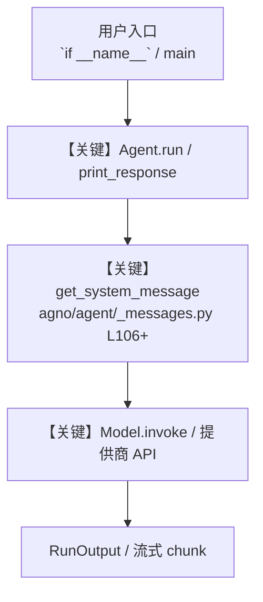

# websearch_tools.py — 实现原理分析

<!-- cookbook-py-source:start -->
## 完整源码

```python
"""
Websearch Tools
=============================

Demonstrates websearch tools.
"""

from agno.agent import Agent
from agno.tools.websearch import WebSearchTools

# ---------------------------------------------------------------------------
# Create Agent
# ---------------------------------------------------------------------------


# Example 1: Basic web search with auto backend selection (default)
# Both web_search and search_news are enabled by default
agent = Agent(
    tools=[WebSearchTools()],
    description="You are a web search agent that helps users find information online.",
    instructions=["Search the web to find accurate and up-to-date information."],
)

# Example 2: Enable only news search
news_agent = Agent(
    tools=[WebSearchTools(enable_search=False, enable_news=True)],
    description="You are a news agent that helps users find the latest news.",
    instructions=[
        "Given a topic by the user, respond with the latest news about that topic."
    ],
)

# Example 3: Use DuckDuckGo backend explicitly
duckduckgo_agent = Agent(tools=[WebSearchTools(backend="duckduckgo")])

# Example 4: Use Google backend
google_agent = Agent(tools=[WebSearchTools(backend="google")])

# Example 5: Use Bing backend
bing_agent = Agent(tools=[WebSearchTools(backend="bing")])

# Example 6: Use Brave backend
brave_agent = Agent(tools=[WebSearchTools(backend="brave")])

# Example 7: Use with proxy and custom timeout
proxy_agent = Agent(
    tools=[WebSearchTools(backend="auto", proxy="socks5://localhost:9050", timeout=30)]
)

# Example 8: Use with fixed max results and modifier
modified_agent = Agent(
    tools=[
        WebSearchTools(
            backend="auto",
            modifier="site:github.com",  # Limit searches to GitHub
            fixed_max_results=3,
        )
    ]
)

# ---------------------------------------------------------------------------
# Run Agent
# ---------------------------------------------------------------------------

if __name__ == "__main__":
    # Run Example 1: Basic web search with auto backend
    print("\n" + "=" * 60)
    print("Example 1: Basic web search with auto backend")
    print("=" * 60)
    agent.print_response("What is the capital of France?", markdown=True)

    # Run Example 2: News-only agent
    print("\n" + "=" * 60)
    print("Example 2: News-only agent")
    print("=" * 60)
    news_agent.print_response("Find recent news about electric vehicles", markdown=True)

    # Run Example 3: DuckDuckGo backend
    print("\n" + "=" * 60)
    print("Example 3: DuckDuckGo backend")
    print("=" * 60)
    duckduckgo_agent.print_response("What is quantum computing?", markdown=True)

    # Run Example 4: Google backend
    print("\n" + "=" * 60)
    print("Example 4: Google backend")
    print("=" * 60)
    google_agent.print_response("What is machine learning?", markdown=True)

    # Run Example 5: Bing backend
    print("\n" + "=" * 60)
    print("Example 5: Bing backend")
    print("=" * 60)
    bing_agent.print_response("What is cloud computing?", markdown=True)

    # Run Example 6: Brave backend
    print("\n" + "=" * 60)
    print("Example 6: Brave backend")
    print("=" * 60)
    brave_agent.print_response("What is blockchain technology?", markdown=True)

    # Run Example 8: Modified search (GitHub only)
    print("\n" + "=" * 60)
    print("Example 8: Modified search (GitHub only)")
    print("=" * 60)
    modified_agent.print_response("Find Python web frameworks", markdown=True)
```

<!-- cookbook-py-source:end -->

> 源文件：`cookbook/91_tools/websearch_tools.py`

## 概述

Websearch Tools

本示例归类：**单 Agent**；模型相关类型：`（见源码 import）`。

**核心配置一览：**

| 配置项 | 值 | 说明 |
|--------|------|------|
| `description` | 'You are a web search agent that helps users find information online.' | `Agent(...)` |

## 架构分层

```
用户 / cookbook 示例              Agno 框架
┌──────────────────────┐         ┌────────────────────────────────┐
│ websearch_tools.py   │  ──▶  │ Agent → get_run_messages → Model │
└──────────────────────┘         └────────────────────────────────┘
                                          │
                                          ▼
                                  ┌───────────────┐
                                  │ 对应 Model 子类 │
                                  └───────────────┘
```

## 核心组件解析

### 运行机制与因果链

1. **入口**：从模块 `__main__` 或暴露的 `agent` / `team` 调用进入；同步用 `print_response` / `run`，异步用 `aprint_response` / `arun`（若源码中有）。
2. **消息**：默认路径下 system 内容由 `get_system_message()`（`libs/agno/agno/agent/_messages.py` 约 **L106** 起）按分段逻辑拼装；若显式传入 `system_message` 则早退使用该字符串。
3. **模型**：具体 HTTP/SDK 形态以 `libs/agno/agno/models/` 下对应类的 `invoke` / `ainvoke` 为准（勿默认写成单一 `chat.completions`）。
4. **副作用**：若配置 `db`、`knowledge`、`memory`，运行会读写存储；仅以本文件为准对照。

### 与框架的衔接

- **System**：`get_system_message()` 锚点 `agno/agent/_messages.py` **L106+**。
- **运行**：`Agent.print_response` 等入口 `agno/agent/agent.py`（以当前仓库检索为准）。

## System Prompt 组装

| 序号 | 组成部分 | 本文件 | 是否生效 |
|------|---------|--------|---------|
| 1 | `instructions` / `description` 等 | 见核心配置表与源码 | 有赋值则生效 |
| 2 | 默认分段（markdown、时间等） | 取决于 `Agent` 默认与显式参数 | 视参数 |

### 拼装顺序与源码锚点

1. `system_message` 直给 → 使用该内容（见 `_messages.py` 文档字符串分支说明）。
2. 否则默认拼装：`description`、`role`、`instructions`、markdown 附加段等按 `# 3.x` 注释顺序合并。

### 还原后的完整 System 文本

```text
--- description ---
You are a web search agent that helps users find information online.
```

### 段落释义（模型视角）

- 指令与安全边界由 `instructions` / `system_message` 约束；若带 `tools` / `knowledge`，文档中需体现「何时检索/调用」由框架注入的提示段支持。

## 完整 API 请求

```python
# 请以本文件实际 Model 为准打开 libs/agno/agno/models/<厂商>/ 下对应类的 invoke：
# 可能是 chat.completions.create、responses.create、Gemini generate_content 等。
```

> 与上一节 system 文本在同一 run 中组合；`developer`/`system` 角色由适配器转换。



**【关键】节点说明：**

- **print_response / run**：用户可见的同步入口。
- **get_system_message**：系统提示拼装核心。
- **Model.invoke**：对模型提供商的实际请求。

## 关键源码文件索引

| 文件 | 作用 |
|------|------|
| `agno/agent/_messages.py` | `get_system_message()` L106+ |
| `agno/agent/agent.py` | `Agent` 运行与 CLI 输出 |
| `agno/models/` | 各厂商 `Model.invoke` |
