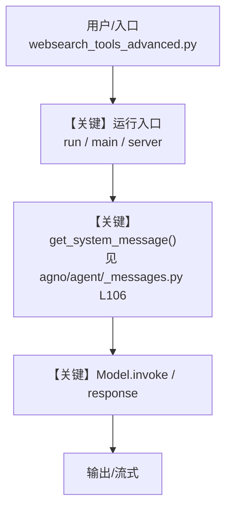

# websearch_tools_advanced.py — 实现原理分析

> 源文件：`cookbook/91_tools/websearch_tools_advanced.py`

## 概述

WebSearch Tools - Advanced Configuration

本示例在 Agno cookbook 中的范式归类：**单 Agent**。

**核心配置一览：**

| 配置项 | 值 | 说明 |
|--------|------|------|
| （见源码） | — | 未能用 AST 抽取首个 `Agent` 关键字参数；请对照 `.py` |

## 架构分层

```
用户/脚本层              Agno 框架层
┌────────────────┐      ┌─────────────────────────────────┐
│ websearch_tools_advanced.py │ ──▶ │ get_system_message / run loop     │
│ （本文件）      │      │ libs/agno/agno/...               │
└────────────────┘      └─────────────────────────────────┘
                                │
                                ▼
                        ┌──────────────┐
                        │ Model 适配器  │
                        └──────────────┘
```

## 核心组件解析

### 运行机制与因果链

1. **数据路径**：从本文件入口（`main` / `if __name__` / 路由）进入，经 Agent/Team/Workflow 构造后进入 Agno 运行循环；系统消息由 `get_system_message()` 等组装。
2. **状态与副作用**：是否使用 `db`、`session_state`、`knowledge` 等请以源码为准；重跑示例可能重复写入会话或存储。
3. **关键分支**：若存在 `stream=True`、工具调用、人工确认等，均影响运行路径；请对照本 `.py` 中的参数与回调。
4. **定位**：本文件属于 cookbook 演示代码，用于说明 **单 Agent** 相关用法。

### 与 System 消息相关的框架锚点

- `get_system_message()`：`agno/agent/_messages.py` **L106** 起。

## System Prompt 组装

| 序号 | 组成部分 | 本文件中的值/来源 | 是否生效 |
|------|---------|-----------------|---------|
| 1 | `description` / `instructions` 等 | 见上表或源码中 `Agent(...)` | 视赋值而定 |
| 2 | 默认拼装 | `get_system_message()` 默认路径 | 未显式覆盖 `system_message` 时 |

### 拼装顺序与源码锚点

1. 若 `agent.system_message` 已提供，优先使用该分支（见 `agno/agent/_messages.py` 文档字符串说明）。
2. 否则在默认路径下按 `_messages.py` 内分段注释依次合并 `description`、`instructions`、`markdown` 附加段等。

### 还原后的完整 System 文本

```text
（请对照本目录下 websearch_tools_advanced.py 中 `Agent` 的字符串字面量自行核对；若为变量拼接或运行时注入，需运行后打印 `get_system_message` 返回值。）
```

### 段落释义（模型视角）

- 本批量文档为**骨架级**再生：具体指令句请以源码中的字面量为准。
- 若含 `instructions`，其约束模型回答风格与任务边界。

## 完整 API 请求

```python
# 请根据本文件实际使用的 Model 类阅读 libs/agno/agno/models/... 中 invoke/ainvoke，
# 选择 Chat Completions、Responses 或其他厂商形态；勿默认 chat.completions.create。
# 下为占位示意：
# model.invoke(...)  # 或 await model.ainvoke(...)
```

> 与第 5 节 system 文本一致：角色名（system/developer）以所用适配器为准。

## Mermaid 流程图



**【关键】节点说明：**

- **运行入口**：对应本示例实际调用 `run` / `print_response` / 服务监听处。
- **get_system_message**：系统提示拼装的核心函数。
- **Model.invoke**：发往模型提供商的请求构造与执行。

## 关键源码文件索引

| 文件 | 关键函数/类 | 作用 |
|------|------------|------|
| `agno/agent/_messages.py` | `get_system_message()` L106+ | 默认 system 消息 |
| `agno/agent/agent.py` | `Agent` | Agent 定义与运行入口 |
| `agno/models/` | 各 `Model` 子类 | `invoke` / 消息格式 |

---
<!-- 批量重新生成：若需「手写级」精修，请对照本 .py 逐项补全配置表与 System 还原。 -->
