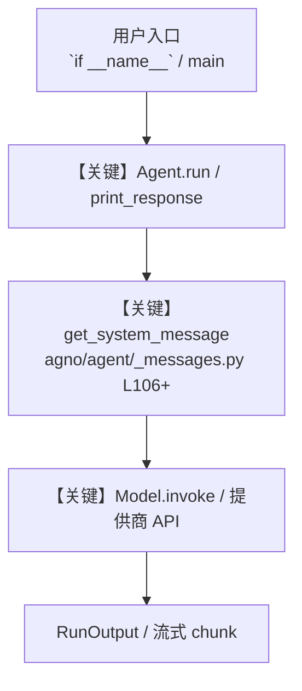

# websearch_tools_advanced.py — 实现原理分析

<!-- cookbook-py-source:start -->
## 完整源码

```python
"""
WebSearch Tools - Advanced Configuration
=========================================

Demonstrates advanced WebSearchTools configuration with timelimit, region,
and backend parameters for customized search behavior across multiple
search engines.

Parameters:
    - timelimit: Filter results by time ("d" = day, "w" = week, "m" = month, "y" = year)
    - region: Localize results (e.g., "us-en", "uk-en", "de-de", "fr-fr", "ru-ru")
    - backend: Search backend ("auto", "duckduckgo", "google", "bing", "brave", "yandex", "yahoo")
"""

from agno.agent import Agent
from agno.models.openai import OpenAIChat
from agno.tools.websearch import WebSearchTools

# ---------------------------------------------------------------------------
# Example 1: Time-limited search with auto backend
# ---------------------------------------------------------------------------
# Filter results to specific time periods

# Past day - for breaking news
daily_agent = Agent(
    model=OpenAIChat(id="gpt-4o"),
    tools=[
        WebSearchTools(
            timelimit="d",  # Results from past day
            backend="auto",
        )
    ],
    instructions=["Search for the most recent information from today."],
)

# Past week - for recent developments
weekly_agent = Agent(
    model=OpenAIChat(id="gpt-4o"),
    tools=[
        WebSearchTools(
            timelimit="w",  # Results from past week
            backend="auto",
        )
    ],
    instructions=["Search for recent information from the past week."],
)

# Past month - for broader recent context
monthly_agent = Agent(
    model=OpenAIChat(id="gpt-4o"),
    tools=[
        WebSearchTools(
            timelimit="m",  # Results from past month
            backend="auto",
        )
    ],
    instructions=["Search for information from the past month."],
)

# Past year - for yearly trends
yearly_agent = Agent(
    model=OpenAIChat(id="gpt-4o"),
    tools=[
        WebSearchTools(
            timelimit="y",  # Results from past year
            backend="auto",
        )
    ],
    instructions=["Search for information from the past year."],
)

# ---------------------------------------------------------------------------
# Example 2: Region-specific searches
# ---------------------------------------------------------------------------
# Localize search results based on region

# US English
us_agent = Agent(
    model=OpenAIChat(id="gpt-4o"),
    tools=[
        WebSearchTools(
            region="us-en",
            backend="auto",
        )
    ],
    instructions=["Provide US-localized search results."],
)

# UK English
uk_agent = Agent(
    model=OpenAIChat(id="gpt-4o"),
    tools=[
        WebSearchTools(
            region="uk-en",
            backend="auto",
        )
    ],
    instructions=["Provide UK-localized search results."],
)

# German
de_agent = Agent(
    model=OpenAIChat(id="gpt-4o"),
    tools=[
        WebSearchTools(
            region="de-de",
            backend="auto",
        )
    ],
    instructions=["Provide German-localized search results."],
)

# French
fr_agent = Agent(
    model=OpenAIChat(id="gpt-4o"),
    tools=[
        WebSearchTools(
            region="fr-fr",
            backend="auto",
        )
    ],
    instructions=["Provide French-localized search results."],
)

# Russian
ru_agent = Agent(
    model=OpenAIChat(id="gpt-4o"),
    tools=[
        WebSearchTools(
            region="ru-ru",
            backend="auto",
        )
    ],
    instructions=["Provide Russian-localized search results."],
)

# ---------------------------------------------------------------------------
# Example 3: Different backend options
# ---------------------------------------------------------------------------
# Use specific search engines as backends

# DuckDuckGo backend
duckduckgo_agent = Agent(
    model=OpenAIChat(id="gpt-4o"),
    tools=[
        WebSearchTools(
            backend="duckduckgo",
            timelimit="w",
            region="us-en",
        )
    ],
)

# Google backend
google_agent = Agent(
    model=OpenAIChat(id="gpt-4o"),
    tools=[
        WebSearchTools(
            backend="google",
            timelimit="w",
            region="us-en",
        )
    ],
)

# Bing backend
bing_agent = Agent(
    model=OpenAIChat(id="gpt-4o"),
    tools=[
        WebSearchTools(
            backend="bing",
            timelimit="w",
            region="us-en",
        )
    ],
)

# Brave backend
brave_agent = Agent(
    model=OpenAIChat(id="gpt-4o"),
    tools=[
        WebSearchTools(
            backend="brave",
            timelimit="w",
            region="us-en",
        )
    ],
)

# Yandex backend
yandex_agent = Agent(
    model=OpenAIChat(id="gpt-4o"),
    tools=[
        WebSearchTools(
            backend="yandex",
            timelimit="w",
            region="ru-ru",  # Yandex works well with Russian region
        )
    ],
)

# Yahoo backend
yahoo_agent = Agent(
    model=OpenAIChat(id="gpt-4o"),
    tools=[
        WebSearchTools(
            backend="yahoo",
            timelimit="w",
            region="us-en",
        )
    ],
)

# ---------------------------------------------------------------------------
# Example 4: Combined configuration - Research assistant
# ---------------------------------------------------------------------------
# Combine all parameters for a powerful research assistant

research_agent = Agent(
    model=OpenAIChat(id="gpt-4o"),
    tools=[
        WebSearchTools(
            backend="auto",  # Auto-select best available backend
            timelimit="w",  # Focus on recent results
            region="us-en",  # US English results
            fixed_max_results=10,  # Get more results
            timeout=20,  # Longer timeout for thorough search
        )
    ],
    instructions=[
        "You are a research assistant that finds comprehensive, recent information.",
        "Always cite your sources and provide context for your findings.",
        "Focus on authoritative and reliable sources.",
    ],
)

# ---------------------------------------------------------------------------
# Example 5: News-focused agent with time and region filters
# ---------------------------------------------------------------------------

news_agent = Agent(
    model=OpenAIChat(id="gpt-4o"),
    tools=[
        WebSearchTools(
            backend="auto",
            timelimit="d",  # Today's news only
            region="us-en",
            enable_search=False,  # Disable general search
            enable_news=True,  # Enable news search only
        )
    ],
    instructions=[
        "You are a news assistant that finds today's breaking news.",
        "Summarize the key points and provide source links.",
    ],
)

# ---------------------------------------------------------------------------
# Example 6: Multi-region comparison agent
# ---------------------------------------------------------------------------
# Create agents for different regions to compare perspectives


def create_regional_agent(region: str, region_name: str) -> Agent:
    """Create a region-specific search agent."""
    return Agent(
        model=OpenAIChat(id="gpt-4o"),
        tools=[
            WebSearchTools(
                backend="auto",
                timelimit="w",
                region=region,
            )
        ],
        instructions=[
            f"You are a search assistant for {region_name}.",
            "Provide localized search results and perspectives.",
        ],
    )


# Create regional agents
us_regional = create_regional_agent("us-en", "United States")
uk_regional = create_regional_agent("uk-en", "United Kingdom")
de_regional = create_regional_agent("de-de", "Germany")

# ---------------------------------------------------------------------------
# Run Examples
# ---------------------------------------------------------------------------
if __name__ == "__main__":
    # Example 1: Time-limited search
    print("\n" + "=" * 60)
    print("Example 1: Weekly time-limited search")
    print("=" * 60)
    weekly_agent.print_response("What are the latest AI developments?", markdown=True)

    # Example 2: Region-specific search (US)
    print("\n" + "=" * 60)
    print("Example 2: US region search")
    print("=" * 60)
    us_agent.print_response("What are trending tech topics?", markdown=True)

    # Example 3: DuckDuckGo backend with filters
    print("\n" + "=" * 60)
    print("Example 3: DuckDuckGo backend with time and region filters")
    print("=" * 60)
    duckduckgo_agent.print_response("What is quantum computing?", markdown=True)

    # Example 4: Research assistant
    print("\n" + "=" * 60)
    print("Example 4: Research assistant (combined configuration)")
    print("=" * 60)
    research_agent.print_response(
        "Find recent research on large language models", markdown=True
    )

    # Example 5: News agent
    print("\n" + "=" * 60)
    print("Example 5: News-focused agent (daily news)")
    print("=" * 60)
    news_agent.print_response("What are today's top tech headlines?", markdown=True)

    # Example 6: Regional comparison
    print("\n" + "=" * 60)
    print("Example 6: US regional agent")
    print("=" * 60)
    us_regional.print_response("What is the economic outlook?", markdown=True)
```

<!-- cookbook-py-source:end -->

> 源文件：`cookbook/91_tools/websearch_tools_advanced.py`

## 概述

WebSearch Tools - Advanced Configuration

本示例归类：**单 Agent**；模型相关类型：`OpenAIChat`。

**核心配置一览：**

| 配置项 | 值 | 说明 |
|--------|------|------|
| `model` | OpenAIChat(id='gpt-4o'…) | `Agent(...)` |
| （Model 类） | `OpenAIChat` | `agno.models` |

## 架构分层

```
用户 / cookbook 示例              Agno 框架
┌──────────────────────┐         ┌────────────────────────────────┐
│ websearch_tools_advanced.py │  ──▶  │ Agent → get_run_messages → Model │
└──────────────────────┘         └────────────────────────────────┘
                                          │
                                          ▼
                                  ┌───────────────┐
                                  │ 对应 Model 子类 │
                                  └───────────────┘
```

## 核心组件解析

### 运行机制与因果链

1. **入口**：从模块 `__main__` 或暴露的 `agent` / `team` 调用进入；同步用 `print_response` / `run`，异步用 `aprint_response` / `arun`（若源码中有）。
2. **消息**：默认路径下 system 内容由 `get_system_message()`（`libs/agno/agno/agent/_messages.py` 约 **L106** 起）按分段逻辑拼装；若显式传入 `system_message` 则早退使用该字符串。
3. **模型**：具体 HTTP/SDK 形态以 `libs/agno/agno/models/` 下对应类的 `invoke` / `ainvoke` 为准（勿默认写成单一 `chat.completions`）。
4. **副作用**：若配置 `db`、`knowledge`、`memory`，运行会读写存储；仅以本文件为准对照。

### 与框架的衔接

- **System**：`get_system_message()` 锚点 `agno/agent/_messages.py` **L106+**。
- **运行**：`Agent.print_response` 等入口 `agno/agent/agent.py`（以当前仓库检索为准）。

## System Prompt 组装

| 序号 | 组成部分 | 本文件 | 是否生效 |
|------|---------|--------|---------|
| 1 | `instructions` / `description` 等 | 见核心配置表与源码 | 有赋值则生效 |
| 2 | 默认分段（markdown、时间等） | 取决于 `Agent` 默认与显式参数 | 视参数 |

### 拼装顺序与源码锚点

1. `system_message` 直给 → 使用该内容（见 `_messages.py` 文档字符串分支说明）。
2. 否则默认拼装：`description`、`role`、`instructions`、markdown 附加段等按 `# 3.x` 注释顺序合并。

### 还原后的完整 System 文本

```text
（主 `Agent(...)` 未传入可静态解析的 `description`/`instructions`/`system_message` 字符串；此时 system 由 `get_system_message()` 默认段与 `markdown` 等开关决定，请在 `agno/agent/_messages.py` 对照分段注释，或在运行中打印 `get_system_message` 返回值。）
```

### 段落释义（模型视角）

- 指令与安全边界由 `instructions` / `system_message` 约束；若带 `tools` / `knowledge`，文档中需体现「何时检索/调用」由框架注入的提示段支持。

## 完整 API 请求

```python
# 请以本文件实际 Model 为准打开 libs/agno/agno/models/<厂商>/ 下对应类的 invoke：
# 可能是 chat.completions.create、responses.create、Gemini generate_content 等。
```

> 与上一节 system 文本在同一 run 中组合；`developer`/`system` 角色由适配器转换。



**【关键】节点说明：**

- **print_response / run**：用户可见的同步入口。
- **get_system_message**：系统提示拼装核心。
- **Model.invoke**：对模型提供商的实际请求。

## 关键源码文件索引

| 文件 | 作用 |
|------|------|
| `agno/agent/_messages.py` | `get_system_message()` L106+ |
| `agno/agent/agent.py` | `Agent` 运行与 CLI 输出 |
| `agno/models/` | 各厂商 `Model.invoke` |
